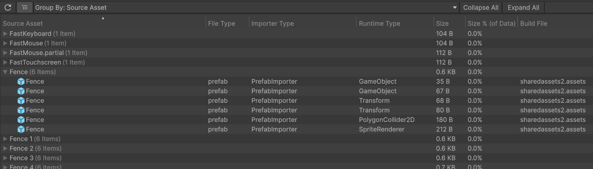

# Example queries for Player build reports

This page shows how to answer common questions about a Player build using the build report data in an [analyze](command-analyze.md) database. The examples reproduce the data views of the **Build** section of the [Project Auditor](https://docs.unity3d.com/6000.6/Documentation/Manual/project-auditor/build-view-reference.html) package.

Each view maps to a short SQL query. Because the queries run against an SQLite database, this approach handles much larger builds than the Project Auditor UI, and the queries can be incorporated into scripts and custom tools. Project Auditor only shows the most recent clean build, while these queries work against any build report in your build history (see [Analyzing multiple build reports](buildreport.md#analyzing-multiple-build-reports)).

See [BuildReport Support](buildreport.md) for the full description of the imported data and the database schema, and [Example usage of Analyze](analyze-examples.md) for general tips about running queries (including from the command line).

The example output on this page comes from a Windows Player build of the [Happy Harvest](https://assetstore.unity.com/packages/essentials/tutorial-projects/happy-harvest-2d-sample-project-259218) sample project, made with Unity 6.6. That build report is included in this repository as a test file, so you can reproduce the output:

```
UnityDataTool analyze TestCommon/Data/BuildReports/happyHarvest.buildreport -o Analysis.db
sqlite3 Analysis.db ".mode column" "<query>"
```

## General build information

The build summary lands in the `build_reports` table, one row per report. The `.mode line` output format of sqlite3 suits this one-row result:

```
sqlite3 Analysis.db ".mode line" "SELECT build_name, platform_name, build_result, start_time, end_time, total_time_seconds, printf('%.1f MB', total_size / 1024.0 / 1024.0) AS total_size, output_path FROM build_reports;"
```

```
        build_name = perf.u6.happy-harvest
     platform_name = Win64
      build_result = Succeeded
        start_time = 2026-07-22T18:50:13.1761397Z
          end_time = 2026-07-22T18:51:41.7167432Z
total_time_seconds = 89
        total_size = 280.0 MB
       output_path = D:/UnitySrc/perf.u6.happy-harvest/Build/perf.u6.happy-harvest.exe
```

`SELECT * FROM build_reports` shows the full set of recorded columns (error and warning counts, build GUID, build options, etc.). In Unity 6.6+ the [Build Analysis window](https://docs.unity3d.com/6000.7/Documentation/Manual/build-analysis-window-reference.html) shows similar summary information directly in the Editor.

## Size by runtime type

A breakdown of the content size by Unity object type, ordered by total size. For Unity 6.6+ reports this is precalculated in the ContentSummary:

```sql
SELECT type_name, printf('%.1f MB', size / 1024.0 / 1024.0) AS pretty_size, object_count
FROM build_report_content_type_stats_view
ORDER BY size DESC LIMIT 10;
```

```
type_name       pretty_size  object_count
--------------  -----------  ------------
Texture2D       101.7 MB     589
AudioClip       9.2 MB       74
Shader          2.5 MB       96
Font            1.5 MB       3
ComputeShader   1.4 MB       104
MonoBehaviour   0.7 MB       1768
ParticleSystem  0.7 MB       91
Sprite          0.6 MB       688
TextAsset       0.4 MB       5
Tilemap         0.4 MB       15
```

Reports from Unity versions before 6.6 have no ContentSummary, but the same breakdown can be computed from the per-object PackedAssets data:

```sql
SELECT type, COUNT(*) AS objects, printf('%.1f MB', SUM(size) / 1024.0 / 1024.0) AS pretty_size
FROM build_report_packed_asset_contents_view
GROUP BY type ORDER BY SUM(size) DESC LIMIT 10;
```

This produces the same numbers for this build (the sizes include the resource data that types like Texture2D and AudioClip store in `.resS` and `.resource` files).

## Objects grouped by source asset

The rest of the examples use `build_report_packed_asset_contents_view`, which has one row per object (or resource blob) in the build output, with its type, size, containing build file, and originating source asset. This is the data behind the object views of Project Auditor, such as this grouping by source asset:



The collapsed group rows correspond to a `GROUP BY` query. The `asset_name` column holds the source asset's filename without extension, matching how the UI names groups. This example also computes each group's share of the total content size, like the UI's "Size % (of Data)" column:

```sql
SELECT asset_name, COUNT(*) AS objects, printf('%.1f MB', SUM(size) / 1024.0 / 1024.0) AS pretty_size,
  printf('%.1f%%', 100.0 * SUM(size) / (SELECT SUM(size) FROM build_report_packed_asset_info)) AS data_pct
FROM build_report_packed_asset_contents_view
GROUP BY asset_name ORDER BY SUM(size) DESC LIMIT 5;
```

```
asset_name                           objects  pretty_size  data_pct
-----------------------------------  -------  -----------  --------
SpriteAtlas_Tiles                    7        48.2 MB      40.0%
Sprite_Pinetree_normal               2        5.1 MB       4.2%
Sprite_Pinetree                      3        3.8 MB       3.2%
Sprite_Pinetree_mask                 2        3.8 MB       3.2%
Background ambience outside - Night  2        3.8 MB       3.1%
```

Expanding a group in the UI corresponds to a filtered query listing the individual objects. Filtering on the full asset path avoids mixing up assets that share a name:

```sql
SELECT type, size, path AS build_file
FROM build_report_packed_asset_contents_view
WHERE build_time_asset_path = 'Assets/HappyHarvest/Art/Tiles/Fence/Prefabs/Fence 8.prefab'
ORDER BY size;
```

```
type               size  build_file
-----------------  ----  --------------------
GameObject         35    sharedassets2.assets
GameObject         67    sharedassets2.assets
Transform          68    sharedassets2.assets
Transform          80    sharedassets2.assets
PolygonCollider2D  180   sharedassets2.assets
SpriteRenderer     212   sharedassets2.assets
```

> **Note:** The build report records which source asset each object came from, but not the object's name. The `find-refs` command and the `objects` table can help identify specific objects when the build output itself is also analyzed — see [Cross-referencing with build output](buildreport.md#cross-referencing-with-build-output).

## Objects grouped by source file extension

The `asset_extension` column holds the source asset's file extension (lower-cased, without the dot). Grouping by it shows which kinds of source files contribute the most content. This is also the closest equivalent to Project Auditor's "Importer Type" grouping, because Unity selects the importer based on the file extension:

```sql
SELECT asset_extension, COUNT(*) AS objects, printf('%.1f MB', SUM(size) / 1024.0 / 1024.0) AS pretty_size,
  printf('%.1f%%', 100.0 * SUM(size) / (SELECT SUM(size) FROM build_report_packed_asset_info)) AS data_pct
FROM build_report_packed_asset_contents_view
GROUP BY asset_extension ORDER BY SUM(size) DESC LIMIT 8;
```

```
asset_extension  objects  pretty_size  data_pct
---------------  -------  -----------  --------
spriteatlasv2    7        48.2 MB      40.0%
png              1039     37.1 MB      30.8%
psd              154      13.0 MB      10.8%
wav              74       9.2 MB       7.6%
                 17       3.1 MB       2.6%
vfx              185      2.9 MB       2.4%
unity            7600     2.0 MB       1.7%
ttf              9        1.5 MB       1.3%
```

The row with the empty extension collects content with no normal source asset path, such as built-in resources (e.g. the splash screen logo) and objects with no recorded source asset. The `unity` row is the objects from the built scenes (Unity 6.6+ reports; older reports do not cover scene files).

Drill into one extension the same way as any other group:

```sql
SELECT asset_name, type, printf('%.1f KB', size / 1024.0) AS pretty_size, path AS build_file
FROM build_report_packed_asset_contents_view
WHERE asset_extension = 'wav' ORDER BY size DESC LIMIT 5;
```

```
asset_name                           type       pretty_size  build_file
-----------------------------------  ---------  -----------  ----------------------
Background ambience outside - Night  AudioClip  3864.0 KB    sharedassets2.resource
Background ambience outside - Day    AudioClip  3829.3 KB    sharedassets2.resource
Rain                                 AudioClip  1242.2 KB    sharedassets2.resource
Thunder                              AudioClip  197.5 KB     sharedassets2.resource
Watering crop-001                    AudioClip  26.3 KB      resources.resource
```

## Objects grouped by build file

The `path` column is the file in the build output that contains the object: a SerializedFile (`level2`, `sharedassets0.assets`, ...) or a resource file (`.resS` for textures and meshes, `.resource` for audio and video):

```sql
SELECT path AS build_file, COUNT(*) AS objects, printf('%.2f MB', SUM(size) / 1024.0 / 1024.0) AS pretty_size
FROM build_report_packed_asset_contents_view
GROUP BY path ORDER BY path;
```

```
build_file                      objects  pretty_size
------------------------------  -------  -----------
globalgamemanagers.assets       1738     1.16 MB
globalgamemanagers.assets.resS  38       2.95 MB
level0                          16       0.00 MB
level1                          17       0.00 MB
level2                          6521     1.82 MB
level3                          1046     0.16 MB
resources.assets                1227     2.23 MB
resources.assets.resS           85       59.32 MB
resources.resource              23       0.17 MB
sharedassets0.assets            72       1.73 MB
...
```

Listing the content of one build file (`ORDER BY offset` shows the objects in their order within the file):

```sql
SELECT asset_name, type, printf('%.1f KB', size / 1024.0) AS pretty_size
FROM build_report_packed_asset_contents_view
WHERE path = 'sharedassets2.resource' ORDER BY asset_name;
```

```
asset_name                           type       pretty_size
-----------------------------------  ---------  -----------
Background ambience outside - Day    AudioClip  3829.3 KB
Background ambience outside - Night  AudioClip  3864.0 KB
Chicken-001                          AudioClip  8.1 KB
Chicken-002                          AudioClip  8.3 KB
Close Window                         AudioClip  2.2 KB
...
```

## Objects grouped by runtime type

The [Size by runtime type](#size-by-runtime-type) section above shows the aggregate query. To see the individual objects of one type, and where they come from:

```sql
SELECT asset_name, build_time_asset_path, size
FROM build_report_packed_asset_contents_view
WHERE type = 'AudioMixerGroup';
```

```
asset_name  build_time_asset_path                             size
----------  ------------------------------------------------  ----
MainMixer   Assets/HappyHarvest/Common/Audio/MainMixer.mixer  40
MainMixer   Assets/HappyHarvest/Common/Audio/MainMixer.mixer  68
MainMixer   Assets/HappyHarvest/Common/Audio/MainMixer.mixer  40
```

## Objects grouped by source asset path

Grouping by the full `build_time_asset_path` distinguishes same-named assets in different folders, and a `LIKE` filter on the path restricts the report to one part of the project — something a fixed UI grouping cannot do:

```sql
SELECT build_time_asset_path, COUNT(*) AS objects, printf('%.1f KB', SUM(size) / 1024.0) AS pretty_size
FROM build_report_packed_asset_contents_view
WHERE build_time_asset_path LIKE 'Assets/HappyHarvest/Art/Tiles/Fence/%'
GROUP BY build_time_asset_path ORDER BY build_time_asset_path;
```

```
build_time_asset_path                                        objects  pretty_size
-----------------------------------------------------------  -------  -----------
Assets/HappyHarvest/Art/Tiles/Fence/Prefabs/Fence 1.prefab   6        0.6 KB
Assets/HappyHarvest/Art/Tiles/Fence/Prefabs/Fence 10.prefab  6        0.6 KB
Assets/HappyHarvest/Art/Tiles/Fence/Prefabs/Fence 11.prefab  6        0.6 KB
Assets/HappyHarvest/Art/Tiles/Fence/Prefabs/Fence 12.prefab  6        0.6 KB
Assets/HappyHarvest/Art/Tiles/Fence/Prefabs/Fence 13.prefab  6        0.6 KB
...
```

Paths outside `Assets/` also appear: package assets (`Packages/...`), built-in resources (`Resources/unity_builtin_extra`), and generated content.

## Beyond a single Player build report

The queries work the same for AssetBundle builds made with `BuildPipeline.BuildAssetBundles`, because those reports populate the same data. For those builds, the `archive` column of `build_report_packed_asset_contents_view` holds the name of the AssetBundle containing each object (for Player builds it is NULL), so you can add it to a query's columns or `GROUP BY` to break the results down by AssetBundle.

The examples above assume a single build report in the database. If you analyze several reports together, add a filter such as `WHERE build_report_filename = '...'` (or `build_report_id`) to the queries — the views expose both columns.
