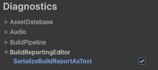

# BuildReport Support

Unity generates a [BuildReport](https://docs.unity3d.com/ScriptReference/Build.Reporting.BuildReport.html) file for Player builds and when building AssetBundles via [BuildPipeline.BuildAssetBundles](https://docs.unity3d.com/ScriptReference/BuildPipeline.BuildAssetBundles.html). Build reports are **not** generated by the [Addressables](addressables-build-reports.md) package or Scriptable Build Pipeline.

Build reports are written to `Library/LastBuild.buildreport` as Unity SerializedFiles (the same binary format used for build output). UnityDataTool can read this format and extract detailed build information using the same mechanisms as other Unity object types.

## UnityDataTool Support

Since build reports are SerializedFiles, you can use [`dump`](command-dump.md) to convert them to text format.

The [`analyze`](command-analyze.md) command extracts build report data into dedicated database tables with custom handlers for:

* **BuildReport** - The primary object containing build inputs and results
* **PackedAssets** - Describes the contents of each SerializedFile, .resS, or .resource file, including type, size, and source asset for each object or resource blob, enabling object-level analysis

**Note:** PackedAssets information is not currently written for scenes in the build.

## Examples

These are some example queries that can be run after running analyze on a build report file.

1. Show all successful builds recorded in the database.

```
SELECT * from build_reports WHERE build_result = "Succeeded"
```

2. Show information about the data in the build that originates from "Assets/Sprites/Snow.jpg".

```
SELECT * 
FROM build_report_packed_asset_contents_view
WHERE build_time_asset_path like "Assets/Sprites/Snow.jpg"
```

3. Show the AssetBundles that contain content from  "Assets/Sprites/Snow.jpg".

```
SELECT DISTINCT assetbundle 
FROM build_report_packed_asset_contents_view
WHERE build_time_asset_path like "Assets/Sprites/Snow.jpg"
```

4. Show all source assets included in the build (excluding C# scripts, e.g. MonoScript objects)

```
SELECT build_time_asset_path from build_report_source_assets WHERE build_time_asset_path NOT LIKE "%.cs"
```

## Cross-Referencing with Build Output

For comprehensive analysis, run `analyze` on both the build output **and** the matching build report file. Use a clean build to ensure PackedAssets information is fully populated.

`analyze` accepts multiple path arguments, each of which can be a file or a directory, so you can pass the build output directory together with the build report path (or the directory containing it) in a single command:

```bash
UnityDataTool analyze /path/to/build/output /path/to/Library/LastBuild.buildreport
```

PackedAssets data provides source asset information for each object that isn't available when analyzing only the build output. Objects are listed in the same order as they appear in the output SerializedFile, .resS, or .resource file.

### Database Relationships

- Match `build_report_packed_assets` rows to analyzed SerializedFiles using `object_view.serialized_file` and `build_report_packed_assets.path`
- Match `build_report_packed_asset_info` entries to objects in the build output using `object_id` (local file ID)

**Note:** build_report_packed_assets` also record .resS and .resource files.  These rows will not match with the serialized_files table.

**Note:** The source object's local file ID is not recorded in PackedAssetInfo. While you can identify the source asset (e.g., which Prefab), you cannot directly pinpoint the specific object within that asset. When needed, objects can often be distinguished by name or other properties.

## Working with Multiple Build Reports

Multiple build reports can be imported into the same database if their filenames differ. Pass each report (and any build output directories) as separate path arguments to a single `analyze` command. This enables:
- Comprehensive build history tracking
- Cross-build comparisons
- Identifying duplicated data between Player and AssetBundle builds

### Prior to Unity 6.6

Each build overwrites `Library/LastBuild.buildreport`. To compare builds, manually collect the report after each build, rename the copies so the filenames are unique (the analyzer keys serialized files by filename), then pass them to `analyze`:

```bash
UnityDataTool analyze build1.buildreport build2.buildreport
```

### Unity 6.6 and later

Player and content directory builds record a structured [build history](https://docs.unity3d.com/6000.6/Documentation/ScriptReference/Build.BuildHistory.html) (default location `Library/BuildHistory`). Unity assigns each build its own directory and gives every build report a unique GUID-based filename, so there is no need to copy or rename reports to compare them. Run `analyze` on the entire build history folder, or on specific build report directories:

```bash
# Analyze every build in the history
UnityDataTool analyze Library/BuildHistory

# Analyze two specific builds
UnityDataTool analyze Library/BuildHistory/20260504-153912Z-2dd7642e Library/BuildHistory/20260504-153855Z-7aff42f4
```

AssetBundle builds are not tracked in the build history; they still write only to `Library/LastBuild.buildreport`.

See the schema sections below for guidance on writing queries that handle multiple build reports correctly.

## Alternatives

UnityDataTool provides low-level access to build reports. Consider these alternatives for easier or more convenient workflows:

### BuildReportInspector Package

View build reports in the Unity Editor using the [BuildReportInspector](https://github.com/Unity-Technologies/BuildReportInspector) package.

### BuildReport API

Access build report data programmatically within Unity using the BuildReport API:

**1. Most recent build:**
Use [BuildPipeline.GetLatestReport()](https://docs.unity3d.com/ScriptReference/Build.Reporting.BuildReport.GetLatestReport.html)

**2. Build report in Assets folder:**
Load via AssetDatabase API:

```csharp
using UnityEditor;
using UnityEditor.Build.Reporting;
using UnityEngine;

public class BuildReportInProjectUtility
{
    static public BuildReport LoadBuildReport(string buildReportPath)
    {
        var report = AssetDatabase.LoadAssetAtPath<BuildReport>("Assets/MyBuildReport.buildReport");

        if (report == null)
            Debug.LogWarning($"Failed to load build report from {buildReportPath}");

        return report;
    }
}
```

**3. Build report outside Assets folder:**
For files in Library or elsewhere, use `InternalEditorUtility`:


```csharp
using System;
using System.IO;
using UnityEditor.Build.Reporting;
using UnityEditorInternal;
using UnityEngine;

public class BuildReportUtility
{
    static public BuildReport LoadBuildReport(string buildReportPath)
    {
        if (!File.Exists(buildReportPath))
            return null;

        try
        {
            var objs = InternalEditorUtility.LoadSerializedFileAndForget(buildReportPath);
            foreach (UnityEngine.Object obj in objs)
            {
                if (obj is BuildReport)
                    return obj as BuildReport;
            }
        }
        catch (Exception ex)
        {
            Debug.LogWarning($"Failed to load build report from {buildReportPath}: {ex.Message}");
        }
        return null;
    }
}
```

### Text Format Access

Build reports can be output in Unity's pseudo-YAML format using a diagnostic flag:



Text files are significantly larger than binary. You can also convert to text by moving the binary file into your Unity project (assets default to text format).

UnityDataTool's `dump` command produces a non-YAML text representation of build report contents.

**When to use text formats:**
- Quick extraction of specific information via text processing tools (regex, YAML parsers, etc.)

**When to use structured access:**
- Working with full structured data: use UnityDataTool's `analyze` command or Unity's BuildReport API

### Addressables Build Reports

The Addressables package generates `buildlayout.json` files instead of BuildReport files. While the format and schema differ, they contain similar information. See [Addressables Build Reports](addressables-build-reports.md) for details on importing these files with UnityDataTool.

## Database Schema

Build report data is stored in the following tables and views:

| Name | Type | Description |
|------|------|-------------|
| `build_reports` | table | Build summary (type, result, platform, duration, etc.) |
| `build_report_files` | table | Files included in the build (path, role, size). See [BuildReport.GetFiles](https://docs.unity3d.com/ScriptReference/Build.Reporting.BuildReport.GetFiles.html) |
| `build_report_archive_contents` | table | Files inside each AssetBundle |
| `build_report_packed_assets` | table | SerializedFile, .resS, or .resource file info. See [PackedAssets](https://docs.unity3d.com/ScriptReference/Build.Reporting.PackedAssets.html) |
| `build_report_packed_asset_info` | table | Each object inside a SerializedFile (or data in .resS/.resource files). See [PackedAssetInfo](https://docs.unity3d.com/ScriptReference/Build.Reporting.PackedAssetInfo.html) |
| `build_report_source_assets` | table | Source asset GUID and path for each PackedAssetInfo reference |
| `build_report_files_view` | view | All files from all build reports |
| `build_report_packed_assets_view` | view | All PackedAssets with their BuildReport, AssetBundle, and SerializedFile |
| `build_report_packed_asset_contents_view` | view | All objects and resources tracked in build reports |

The `build_reports` table contains primary build information. Additional tables store detailed content data. Views simplify queries by automatically joining tables, especially when working with multiple build reports.

### Schema Overview

Views automatically identify which build report each row belongs to, simplifying multi-report queries. To create custom queries, understand the table relationships:

**Primary relationships:**
- `build_reports`: One row per analyzed BuildReport file, corresponding to the BuildReport object in the `objects` table via the `id` column
- `build_report_packed_assets`: Records the `id` of each PackedAssets object. Find the associated BuildReport via the shared `objects.serialized_file` value (PackedAssets are processed independently of BuildReport objects)

**Auxiliary tables:**
- `build_report_files` and `build_report_archive_contents`: Stores the BuildReport object `id` for each row (as `build_report_id`).
- `build_report_packed_asset_info`: Stores the PackedAssets object `id` for each row (as `packed_assets_id`).
- `build_report_source_assets`: Normalized table of distinct source asset GUIDs and paths, linked via `build_report_packed_asset_info.source_asset_id`

**Note:** BuildReport and PackedAssets objects are also linked in the `refs` table (BuildReport references PackedAssets in its appendices array), but this relationship is not used in built-in views since `refs` table population is optional.

**Example: build_report_packed_assets_view**

This view demonstrates key relationships:
- Finds the BuildReport object (`br_obj`) by type (1125) and shared `serialized_file` with the PackedAssets (`pa`)
- Retrieves the serialized file name from `serialized_files` table (`sf.name`)
- For AssetBundle builds, retrieves the AssetBundle name from `build_report_archive_contents` by matching BuildReport ID and PackedAssets path (`assetbundle` is NULL for Player builds)

```
CREATE VIEW build_report_packed_assets_view AS
SELECT
    pa.id,
    o.object_id,
    brac.assetbundle,
    pa.path,
    pa.file_header_size,
    br_obj.id as build_report_id,
    sf.name as build_report_filename
FROM build_report_packed_assets pa
INNER JOIN objects o ON pa.id = o.id
INNER JOIN serialized_files sf ON o.serialized_file = sf.id
LEFT JOIN objects br_obj ON o.serialized_file = br_obj.serialized_file AND br_obj.type = 1125
LEFT JOIN build_report_archive_contents brac ON br_obj.id = brac.build_report_id AND pa.path = brac.assetbundle_content;
```

### Column Naming

For consistency and clarity, database columns use slightly different names than the BuildReport API:

| Database Column | BuildReport API | Notes |
|-----------------|-----------------|-------|
| `build_report_packed_assets.path` | `PackedAssets.ShortPath` | Filename of the SerializedFile, .resS, or .resource file ("short" was redundant since only one path is recorded) |
| `build_report_packed_assets.file_header_size` | `PackedAssets.Overhead` | Size of the file header (zero for .resS and .resource files) |
| `build_report_packed_asset_info.object_id` | `PackedAssetInfo.fileID` | Local file ID of the object (renamed for consistency with `objects.object_id`) |
| `build_report_packed_asset_info.type` | `PackedAssetInfo.classID` | Unity object type (renamed for consistency with `objects.type`) |

## Limitations

**Duplicate filenames:** Multiple build reports cannot be imported into the same database if they share the same filename. This is a general UnityDataTool limitation that assumes unique SerializedFile names.

**Type names:** While `build_report_packed_asset_info.type` records valid [Class IDs](https://docs.unity3d.com/Manual/ClassIDReference.html), the string type name may not exist in the `types` table. The `types` table is only populated when processing object instances (during TypeTree analysis). Analyzing both build output **and** build report together ensures types are fully populated; otherwise only numeric IDs are available.

### Information Not Exported

Currently, only the most useful BuildReport data is extracted to SQL. Additional data may be added as needed:

* [Code stripping](https://docs.unity3d.com/ScriptReference/Build.Reporting.BuildReport-strippingInfo.html) appendix (IL2CPP Player builds)
* [ScenesUsingAssets](https://docs.unity3d.com/ScriptReference/Build.Reporting.BuildReport-scenesUsingAssets.html) (detailed build reports)
* `BuildReport.m_BuildSteps` array (SQL may not be ideal for this hierarchical data)
* `BuildAssetBundleInfoSet` appendix (undocumented object listing files in each AssetBundle; `build_report_archive_contents` currently derives this from the File list)
* Analytics-only appendices (unlikely to be valuable for analysis)

