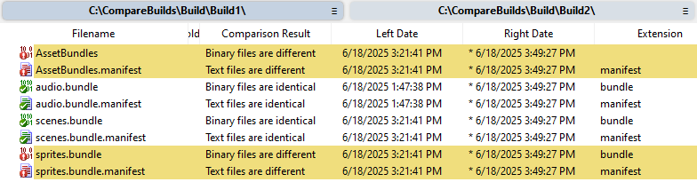
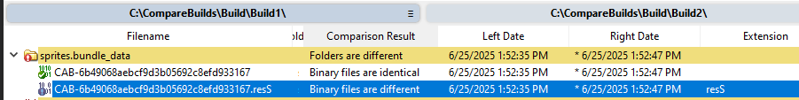
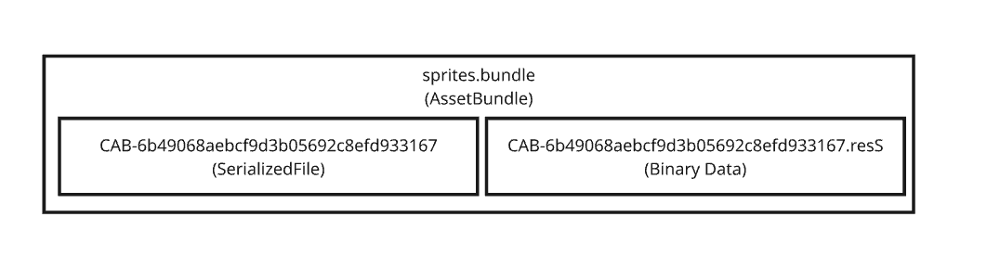
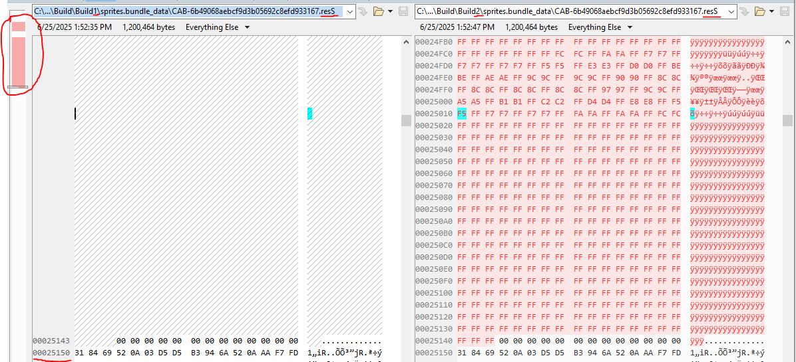
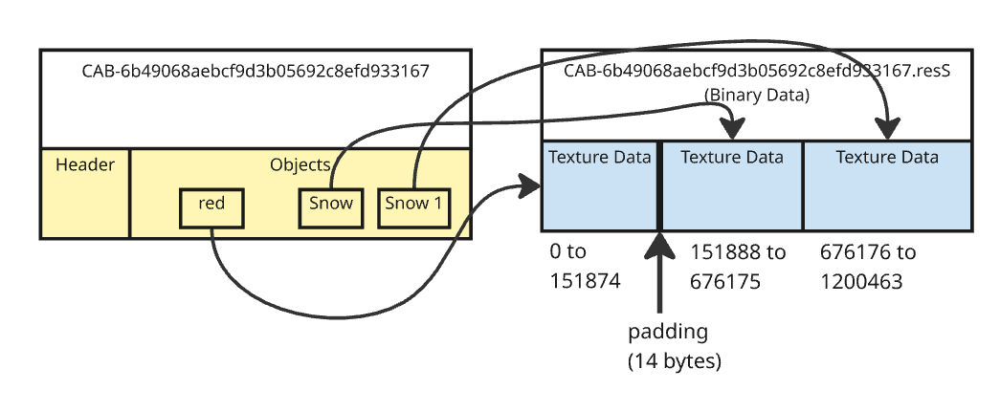

# Comparing Builds

The output can change each time a build is performed. Normally the change should be predictable, based on changes in the Unity project.  But in other cases there may be a bug of "non-determinism", where the build changes each time it is run, or has different output from different identical build machines.  So a common question is "what changed" between builds?  This question arises most frequently in the area of AssetBundles, so the examples here focus on that type of build.  But the same principals can also apply to Player builds.

For the purpose of these examples, suppose that two builds of the same project are located side-by-side in two directories, /build1 and /build2.  This build includes an AssetBundle called "sprites.bundle" that contains 3 textures ("red.png", "Snow.png" and "Snow 1.png").

## File-level comparison

A quick way to compare two builds is to do a file-level comparison, e.g. using a diff tool such as `WinMerge` to compare build1 and build2.



This will quickly narrow down which AssetBundle files have changed.  But AssetBundles files are binary archive files, so this won't show what changed inside the files.

## UnityDataTool object comparison

UnityDataTools does not natively support comparing two builds, but it can be done by analyzing each build individually into separate SQLite databases, then running queries to compare the contents of the two databases.

For example two database could be generated as follows:

```
UnityDataTool.exe analyze -o build1.db .\Build1\
UnityDataTool.exe analyze -o build2.db .\Build2\
```

Running the following PowerShell script would print all the objects, with info about whether they match between the two builds.  Objects are matched primarily based on the AssetBundle and local file ID (object_id) matching.  If there is a change in content then the CRC should change. The object size is also shown (which includes the actual texture data).

```
param (
    [Parameter(Mandatory=$true, HelpMessage="Path to the first UnityDataTool database")]
    [string]$db1,

    [Parameter(Mandatory=$true, HelpMessage="Path to the second UnityDataTool database")]
    [string]$db2
)

# Check if the database file exists
if (-not (Test-Path $db1)) {
    Write-Error "Database file '$db1' not found."
    exit 1
}

if (-not (Test-Path $db2)) {
    Write-Error "Database file '$db2' not found."
    exit 1
}

# SQL query to compare the content of two builds.
# Note: when the ID of an object changes then it will not be matched as the same.
$query = @"
ATTACH DATABASE '$db2' AS db2;

SELECT
    COALESCE(o1.asset_bundle, o2.asset_bundle) AS asset_bundle,
    COALESCE(o1.object_id, o2.object_id) AS object_id,
    COALESCE(o1.type, o2.type) AS type,
    COALESCE(o1.name, o2.name) AS name,
    CASE
        WHEN o1.asset_bundle IS NULL THEN 'Only in Build 1'
        WHEN o2.asset_bundle IS NULL THEN 'Only in Build 2'
        WHEN o1.crc32 != o2.crc32 OR o1.size != o2.size THEN 'Different'
        ELSE 'Same'
    END AS status,
    o1.size AS size_build1,
    o2.size AS size_build2,
    o1.crc32 AS crc32_build1,
    o2.crc32 AS crc32_build2
FROM (
    SELECT
        ab.name AS asset_bundle,
        o.object_id,
        t.name AS type,
        o.name,
        o.size,
        o.crc32,
        sf.name AS serialized_file
    FROM
        objects o
    INNER JOIN
        types t ON o.type = t.id
    INNER JOIN
        serialized_files sf ON o.serialized_file = sf.id
    LEFT JOIN
        asset_bundles ab ON sf.asset_bundle = ab.id
) AS o1
FULL OUTER JOIN (
    SELECT
        ab.name AS asset_bundle,
        o.object_id,
        t.name AS type,
        o.name,
        o.size,
        o.crc32,
        sf.name AS serialized_file
    FROM
        db2.objects o
    INNER JOIN
        db2.types t ON o.type = t.id
    INNER JOIN
        db2.serialized_files sf ON o.serialized_file = sf.id
    LEFT JOIN
        db2.asset_bundles ab ON sf.asset_bundle = ab.id
) AS o2 ON o1.asset_bundle = o2.asset_bundle
    AND o1.object_id = o2.object_id
    AND o1.type = o2.type
    AND o1.name = o2.name
    AND o1.serialized_file = o2.serialized_file;

DETACH DATABASE db2;
"@

# Execute the query
Write-Host "Objects with differences, only in one DB, or the same:"
$results = sqlite3 $db1 ".mode column" $query
$results | ForEach-Object { Write-Output $_ }
```

This is a partial example output, where the "red.png" file has been edited between builds:


```
asset_bundle    object_id             type                 name                 status     size_build1  size_build2  crc32_build1  crc32_build2
--------------  --------------------  -------------------  -------------------  ---------  -----------  -----------  ------------  ------------
AssetBundles    1                     AssetBundle                               Same       104          104          241569179     241569179
AssetBundles    2                     AssetBundleManifest  AssetBundleManifest  Different  184          184          4124235088    3102991602
audio.bundle    -1630896013228033972  AudioClip            audio                Same       18656        18656        883020518     883020518
audio.bundle    1                     AssetBundle          audio.bundle         Same       144          144          2644028121    2644028121
sprites.bundle  -4266742476527514910  Sprite               Snow 1               Same       464          464          2360191667    2360191667
sprites.bundle  -39415655269619539    Texture2D            Snow 1               Same       524496       524496       3893000759    3893000759
sprites.bundle  -3600607445234681765  Texture2D            red                  Different  152079       152079       3533099562    3115177070
sprites.bundle  -1350043613627603771  Texture2D            Snow                 Same       524492       524492       3894005184    3894005184
sprites.bundle  1                     AssetBundle          sprites.bundle       Same       460          460          245831303     245831303
```

The output pinpoints that "red" has changed. The AssetBundleManifest object also changes, which is expected because it lists AssetBundle hashes.

Note: This script is intentionally verbose for the sake of demonstration.  For very large builds you probably would want to filter down to only show the objects that have changed, and perhaps focus only on certain files or object types.  It should just be considered as a starting point for your own comparison scripts.

### Comparing Individual AssetBundles

A variation of the PowerShell script above could be used to compare two versions of a single AssetBundle.  It creates temporary sqlite databases so that the comparison is a simple one-step process.

For example, to analyze the two versions of sprites.bundle it could be invoked like this:

```
comparebundles.ps1 .\Build1\sprites.bundle .\Build2\sprites.bundle
```

The script is as follows:

```
# PowerShell Script to compare the objects inside two versions of an AssetBundle
param(
    [Parameter(Mandatory=$true, HelpMessage="Path to the first AssetBundle")]
    [string]$FileName1,

    [Parameter(Mandatory=$true, HelpMessage="Path to the second AssetBundle")]
    [string]$FileName2
)

if (-not (Test-Path -Path $FileName1)) {
    Write-Error "File '$FileName1' does not exist."
    exit 1
}

if (-not (Test-Path -Path $FileName2)) {
    Write-Error "File '$FileName2' does not exist."
    exit 1
}

# Separate the directory and file name
$FileDir1 = Split-Path -Path $FileName1 -Parent
$FileLeaf1 = Split-Path -Path $FileName1 -Leaf

# If no directory is detected (relative file name), use the current working directory
if (-not $FileDir1) {
    $FileDir1 = "."
}

$FileDir2 = Split-Path -Path $FileName2 -Parent
$FileLeaf2 = Split-Path -Path $FileName2 -Leaf
if (-not $FileDir2) {
    $FileDir2 = "."
}

# Retrieve the system's temp folder and create the temporary database file names
$tempFolder = $env:TEMP
$dbName1 = Join-Path -Path $tempFolder -ChildPath ("1_$FileLeaf1.db")
$dbName2 = Join-Path -Path $tempFolder -ChildPath ("2_$FileLeaf2.db")

#Analyze each AssetBundle into temporary databases
UnityDataTool analyze $FileDir1 -o $dbName1 -p $FileLeaf1
UnityDataTool analyze $FileDir2 -o $dbName2 -p $FileLeaf2

$query = @"
ATTACH DATABASE '$dbName2' AS db2;

SELECT
    COALESCE(o1.serialized_file, o2.serialized_file) AS serialized_file,
    COALESCE(o1.object_id, o2.object_id) AS object_id,
    COALESCE(o1.type, o2.type) AS type,
    COALESCE(o1.name, o2.name) AS name,
    CASE
        WHEN o1.asset_bundle IS NULL THEN 'Only in Build 1'
        WHEN o2.asset_bundle IS NULL THEN 'Only in Build 2'
        ELSE 'Different'
    END AS status,
    o1.size AS size_build1,
    o2.size AS size_build2,
    o1.crc32 AS crc32_build1,
    o2.crc32 AS crc32_build2
FROM (
    SELECT
        ab.name AS asset_bundle,
        o.object_id,
        t.name AS type,
        o.name,
        o.size,
        o.crc32,
        sf.name AS serialized_file
    FROM
        objects o
    INNER JOIN
        types t ON o.type = t.id
    INNER JOIN
        serialized_files sf ON o.serialized_file = sf.id
    LEFT JOIN
        asset_bundles ab ON sf.asset_bundle = ab.id
) AS o1
FULL OUTER JOIN (
    SELECT
        ab.name AS asset_bundle,
        o.object_id,
        t.name AS type,
        o.name,
        o.size,
        o.crc32,
        sf.name AS serialized_file
    FROM
        db2.objects o
    INNER JOIN
        db2.types t ON o.type = t.id
    INNER JOIN
        db2.serialized_files sf ON o.serialized_file = sf.id
    LEFT JOIN
        db2.asset_bundles ab ON sf.asset_bundle = ab.id
) AS o2 ON o1.asset_bundle = o2.asset_bundle
    AND o1.object_id = o2.object_id
    AND o1.serialized_file = o2.serialized_file
WHERE NOT (o1.asset_bundle IS NOT NULL AND o2.asset_bundle IS NOT NULL AND o1.crc32 = o2.crc32 AND o1.size = o2.size);

DETACH DATABASE db2;
"@

# Query the database using sqlite3
sqlite3 $dbName1 ".mode column" $query

# Delete the temporary database files
Remove-Item $dbName1 -Force
Remove-Item $dbName2 -Force
```

For the sake of brevity, the query above does not list objects when they are the same in both AssetBundles. It also shows the SerializedFile name instead of the AssetBundle name.  The output from this example would be:


```
serialized_file                       object_id             type       name  status     size_build1  size_build2  crc32_build1  crc32_build2
------------------------------------  --------------------  ---------  ----  ---------  -----------  -----------  ------------  ------------
CAB-6b49068aebcf9d3b05692c8efd933167  -3600607445234681765  Texture2D  red   Different  152079       152079       3533099562    3115177070
```

### Analyzing Differences in .ResS Files

UnityDataTool helps pinpoint which AssetBundle objects have changed between builds.  But to actually understand "what" has changed it is necessary to look deeper into the content of the AssetBundles and how Unity serializes data.

We already know that sprites.bundle has changed between builds, and the script pinpoints "red" as the object that changed, whereas "Snow" and "Snow 1" are unchanged.  So how can we determine more information about what has changed about "red.png"?

To go deeper we can extract the content of each build of sprites.bundle.  The **WebExtract** tool that is shipped with Unity can be used to do this.  When run on an AssetBundle it creates a subdirectory with all the contents of the AssetBundle expanded as individual files.

```
cd Build1
WebExtract.exe sprites.bundle
cd ..\Build2
WebExtract.exe sprites.bundle
```

When WebExtract has been run on both copies of sprites.bundle the directory comparison shows this result:



So we see that the AssetBundle contains the following content:



Based on the diff we see that the SerializedFile is the same, but the .resS file is different.  This means that the Texture2D object has the exact same properties (including dimensions, format etc), but the pixel data is different.  That information may already be sufficient to fully understand why the AssetBundle has changed.

For the sake of further illustration, we can go deeper and look at how the .resS file relates to the 3 textures in sprites.bundle. 

When a binary diff is performed on the two verions of the .resS file we can see that all the differences are located near the start of the file, finishing before address 0x25150 (151,888 in decimal).  The rest of the file is identical.



We can surmise that the "red" texture is at the start of the .resS file, because we know that from our UnityDataTool queries that "red" is the only texture that changed.  But we could also determine this by further analysis of the AssetBundle contents.

To understand the content of a resS file we have to look at the associated SerializedFile.  E.g. to understand what is contained inside `CAB-6b49068aebcf9d3b05692c8efd933167.resS` we need to look inside `CAB-6b49068aebcf9d3b05692c8efd933167`.

Because the SerializedFile is a binary format, we first need to convert it to text.  We can do this using the `dump` feature of UnityDataTools.  We can run this on either build1 or build2 (because the file is identical from both builds).

```
UnityDataTool dump CAB-6b49068aebcf9d3b05692c8efd933167
```

Inside this file we can search for all mentions of "CAB-6b49068aebcf9d3b05692c8efd933167.resS". This search discovers 3 Texture2D objects.  These are the relevant parts of the output file:

```
ID: -3600607445234681765 (ClassID: 28) Texture2D
  m_Name (string) red
  ...
  m_StreamData (StreamingInfo)
    offset (UInt64) 0
    size (unsigned int) 151875
    path (string) archive:/CAB-6b49068aebcf9d3b05692c8efd933167/CAB-6b49068aebcf9d3b05692c8efd933167.resS
```

```
ID: -1350043613627603771 (ClassID: 28) Texture2D
  m_Name (string) Snow
  ...
  m_StreamData (StreamingInfo)
    offset (UInt64) 151888
    size (unsigned int) 524288
    path (string) archive:/CAB-6b49068aebcf9d3b05692c8efd933167/CAB-6b49068aebcf9d3b05692c8efd933167.resS
```

```
ID: -39415655269619539 (ClassID: 28) Texture2D
  m_Name (string) Snow 1
  ...
  m_StreamData (StreamingInfo)
    offset (UInt64) 676176
    size (unsigned int) 524288
    path (string) archive:/CAB-6b49068aebcf9d3b05692c8efd933167/CAB-6b49068aebcf9d3b05692c8efd933167.resS

```

The resS file is a simple format with no header.  It is literally just the binary data of textures or meshes, concatenated together, sometimes with padding in between.  The m_StreamData describes each range of bytes inside the .resS file.  The total file size on disk is 1200463 bytes so every byte of the file is accounted for based on those three objects.



In this case the range information for "red" exactly matches the changes we observed in the binary diff.  So this matches our understanding that pixel data inside "red.png" caused the AssetBundle content to change.

This same approach can be used to analyze mesh data inside .resS files.  And also for Audio and Video inside .resource files.
