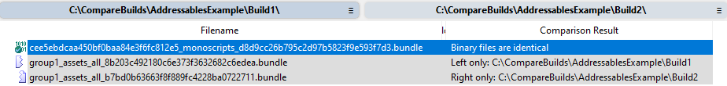
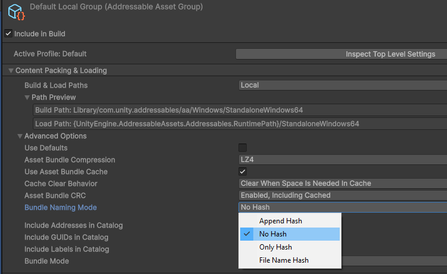
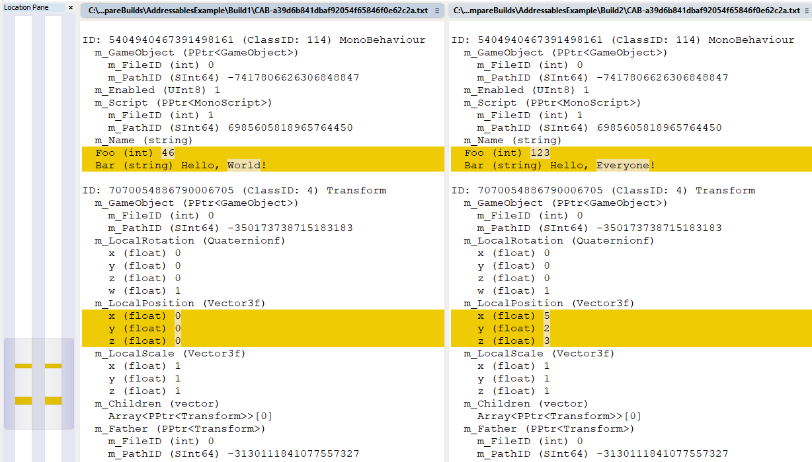

# Comparing Builds

This topic gives examples using several tools and techniques to compare build output files.

The tools used in this topic are as follows:

* [comparebuilds.ps1](../Scripts/comparebuilds.ps1) An example script using UnityDataTool to compare two builds at the object level
* [comparebundles.ps1](../Scripts/comparebundles.ps1) An example script using UnityDatatTool to compare two versions of an AssetBundle.
* A diff tool for comparing directories, binary files and text files.  These tools are readily available on Windows, Mac and Linux.  For example Beyond Compare, WinMerge, and kdiff3.
* WebExtract.  A tool for extracting contents of an Unity Archive file (WebExtract is included in the Unity Editor installation).
* `UnityDataTool dump`.  A feature of UnityDataTool that create a text representation of the content of a Unity Serialized File.
* binary2text.  A tool very similar to UnityDataTool dump.  It is slower but has a few features that are not yet exposed by UnityDataTool.  (binary2text is included in the Unity Editor installation).

The [Overview of Unity Content](./unity-content-format.md) topic gives useful background for the file formats involved when comparing builds.

## Why Compare Builds?

When working with Unity a project will typically be rebuilt many times, as part of testing or as new content is released.  Each time a build is performed it is likely that some content will changed.  Normally the change should be predictable, based on changes made to assets, scenes, scripts, packages or upgrades to the Unity Editor.  When nothing has changed at all the build output should be exactly the same as the previous build.

Sometimes the change in a build may be unexpected, for example if there is a significant change in the size of the output, or when many AssetBundles have new content hashes after what was expected to be a small routine rebuild.  So we may want to compare different versions of a build to try to understand why a large output change has occurred.

A particular important reason for comparing builds is when there seems to be a problem of **non-determinism**.  Non-determinism means that the build output changes when rebuilt, even when nothing has changed in the source project.  Sometimes this is observed on the same machine, or sometimes when built on different machines even when they have similar operating system and hardware.  For some projects this is not a problem, but any non-determinism can be problematic for the creation of clean and efficient build pipelines and release and distribution processes.  Often these problems can be attributed back to code running in build callbacks or Awake methods, including code in 3rd party packages.  And there are some known non-determinism in some texture compression algorithms.  Or it may be caused because certain critical files are not included in source control.  However in some rare cases this require a bug report back to Unity.  The techniques described here can pinpoint the source of the non-determinism and help finding a resolution.

When comparing builds there may be a huge number of individual differences.  The main goal is to try to classify the changes down enough to give some insight into the root causes to see if these changes are "expected" and if they can be avoided.  For example, you may realize that a change to a single global setting has impacted the variants of all the Shaders.  Or, that a change adding new fields to a widely used MonoBehaviour has changed many scenes and prefabs.  Or that a single asset is duplicated in many AssetBundles, so changing it has impacted all of them.

## AssetBundles and Player Builds

This topic focuses on AssetBundles, because most questions about changes in a build come up around AssetBundles.  However the same techniques can also be used to analyze player builds (so long as the player is built with [TypeTrees enabled](./unity-content-format.md#enabling-typetrees-in-the-player)).

# Example 1 - Changes to serialized values in an Addressables build

AssetBundles contain the serialized state of objects. If objects are added or removed then obviously the AssetBundle will change.  But another common cause of changes in an AssetBundle is when the serialized values of objects change.

For example, consider a build using the Addressables package that just builds a small Prefab.  The Prefab includes two GameObjects, plus a MonoBehavior Component that is an instance of this class.

```
using UnityEngine;

public class MyMonoBehaviour : MonoBehaviour
{
    public int Foo = 42;
    public string Bar = "Hello, World!";
}
```

A first build is made that outputs two AssetBundles (into the Addressables location inside the Library folder). A copy of this build is created by saving it into a directory called `Build1`.

Then the Prefab is edited to apply two small changes:

* the position on the Tranform component of one of the GameObjects is changed
* the value of the two fields on the MyMonoBehaviour component are changed.

Finally a second build is performed, and the output saved into the `Build2` directory.  

We will use tools to compare the two builds.

## Diff Comparison

A quick way to compare two builds is to do a file-level comparison, e.g. using a diff tool such as `WinMerge` to compare build1 and build2.



This will quickly narrow down which AssetBundle files have changed.  But AssetBundles files are binary archive files, so this won't show what has changed **inside** the files.

Addressables builds, by default, include the content hash as part of the file name.  This means that the entire file name changes when the content changes.  So in this case the changes to the prefab result in `group1_assets_all_8b203c492180c6e373f3632682c6edea.bundle` being renamed to `group1_assets_all_b7bd0b63663f8f889fc4228ba0722711.bundle`.  This makes it harder to match up the equivalent files in comparison tools.  But in this very simple case its not hard to see that the file was renamed because of a change in the hash.

>[!TIP]
>The hash can be removed from the bundle file names, by changing a Group-level preference in Addressables to specify "No Hash".  The "No Hash" option can make it easier to compare and work with the output from Addressables builds and can be a better setting to use overall for many projects.  However, because hashes are the default, this example uses that naming convention.



## UnityDataTool object comparison

UnityDataTools does not natively support comparing two builds.  But we can do it by analyzing each build individually, into two SQLite databases, then running cross-database queries to compare the contents of the two builds.

For example, two database could be generated as follows:

```
UnityDataTool.exe analyze -o build1.db .\Build1\
UnityDataTool.exe analyze -o build2.db .\Build2\
```

The [comparebuilds.ps1](../Scripts/comparebuilds.ps1) script is an example PowerShell script that prints a comparison of each object. In this case the output would be something like this:


```
asset_bundle                                                  object_id             type           name                                                 status     size_build1  size_build2  crc32_build1  crc32_build2
------------------------------------------------------------  --------------------  -------------  ---------------------------------------------------  ---------  -----------  -----------  ------------  ------------
cee5ebdcaa450bf0baa84e3f6fc812e5_monoscripts_d8d9cc26b795c2d  1                     AssetBundle    cee5ebdcaa450bf0baa84e3f6fc812e5_monoscripts.bundle  Same       164          164          3099751197    3099751197
97b5823f9e593f7d3.bundle

cee5ebdcaa450bf0baa84e3f6fc812e5_monoscripts_d8d9cc26b795c2d  6985605818965764450   MonoScript     MyMonoBehaviour                                      Same       84           84           3996385875    3996385875
97b5823f9e593f7d3.bundle

group1_assets_all_8b203c492180c6e373f3632682c6edea.bundle     -7417806626306848847  GameObject     GameObject                                           Same       51           51           4246140359    4246140359

group1_assets_all_8b203c492180c6e373f3632682c6edea.bundle     7800266938829834161   Transform                                                           Same       68           68           934917823     934917823

group1_assets_all_8b203c492180c6e373f3632682c6edea.bundle     5404940467391498161   MonoBehaviour                                                       Different  56           56           843380543     2454703857

group1_assets_all_8b203c492180c6e373f3632682c6edea.bundle     -3130111841077557327  Transform                                                           Same       92           92           4113599061    4113599061

group1_assets_all_8b203c492180c6e373f3632682c6edea.bundle     -1433429198062811215  GameObject     MyPrefab                                             Same       35           35           1577821869    1577821869

group1_assets_all_8b203c492180c6e373f3632682c6edea.bundle     7070054886790006705   Transform                                                           Different  68           68           1402962886    1895291976

group1_assets_all_8b203c492180c6e373f3632682c6edea.bundle     -350173738715183183   GameObject     GameObject2                                          Same       39           39           4260572786    4260572786

group1_assets_all_8b203c492180c6e373f3632682c6edea.bundle     1                     AssetBundle    15bea74e638d7d4118f8b0a23ddac6b6.bundle              Same       324          324          2773319152    2773319152

```

Changes are detected by matching up the objects from each database and comparing their CRC and size values.  For large builds the output would be very verbose, but for the purpose of this example it confirms that only one Transform and the MonoBehaviour have changed between the two builds.

The script also supports printing out objects that only exist in one of the two builds (e.g. objects that have been added or removed).

### Comparing Individual AssetBundles

A variation of comparing entire builds is to compare two versions of an individual AssetBundle.

The script [comparebundles.ps1](../Scripts/comparebundles.ps1) is an example of this approach.  It creates temporary sqlite databases, so that the comparison is a convenient one-step process.

Running
```
comparebundles.ps1 .\Build1\group1_assets_all_8b203c492180c6e373f3632682c6edea.bundle .\Build2\group1_assets_all_b7bd0b63663f8f889fc4228ba0722711.bundle
```

Will output:

```
serialized_file                       object_id            type           name  status     size_build1  size_build2  crc32_build1  crc32_build2
------------------------------------  -------------------  -------------  ----  ---------  -----------  -----------  ------------  ------------
CAB-a39d6b841dbaf92054f65846f0e62c2a  5404940467391498161  MonoBehaviour        Different  56           56           2646584758    378564635
CAB-a39d6b841dbaf92054f65846f0e62c2a  7070054886790006705  Transform            Different  68           68           2385093893    2906782347
```

This really narrows things down to the two objects that actually changed.  But it doesn't explain what changed inside each object.

## Comparing Serialized File content

To actually see precisely what changed we need to look at the content of the SerializedFiles inside the AssetBundles.  The UnityDataTool can be used to dump the content of the SerializedFiles into a human-readable format, similar to the `binary2text` tool.

For example:

```
UnityDataTool dump .\Build1\group1_assets_all_8b203c492180c6e373f3632682c6edea.bundle -o .\Build1
```

This finds the Serialized Files inside the AssetBundle.  In this case its a single file with a name like "CAB-.....").  UnityDataTool reads the file and produced a text representation in the specified output directory ("Build1/CAB-a39d6b841dbaf92054f65846f0e62c2a.txt").

The same process can be repeated for the equivalent AssetBundle in the second build directory.

The files include an exhaustive dump of all the serialized data for all the objects.  In this simple case there only a few objects, so the file is relatively small.

The exact differences are easiest to see by using a diff tool:



As expected, it's only fields on the MonoBehaviour and one of the Transforms that have new values.

In a normal case we would not know exactly what changed in the build, so rather than confirming the expected changes we probably would be working in the other direction - using comparison technique to see which objects and values changed and try to build an understanding of whether this is "expected" or not.

# Example 2 - Changes in a texture

The previous example covers the common case where the changes are limited to serialized values directly inside Serialized Files.  However its also common that data inside the auxiliary .resS and .resource files can change, based on changes to textures, meshes, audio or video.  This can also cause the AssetBundle content to change, even if the Serialized Files themselves are unchanged.

As an example of that case, suppose we have a non-Addressable AssetBundle build that includes an AssetBundle called "sprites.bundle".  It contains 3 textures ("red.png", "Snow.png" and "Snow 1.png").  The pixels of the "red.png" texture has been changed between the two builds, while the other two textures are unchanged.

As in example 1, we put the two snapshot copies of the AssetBundles into the folder Build1 and Build2.

Note: These AssetBundles were originally built into a folder named "AssetBundles" so the output also includes an "Manifest Bundle" named `AssetBundle` that contains the AssetBundleManifest object.  See [AssetBundle file format reference](https://docs.unity3d.com/6000.1/Documentation/Manual/assetbundles-file-format.html) for details.

## File-level comparison

A diff tool can be used to compare the build output in build1 and build2.


This shows that only two AssetBundle have changed, the sprites.bundle and the manifest bundle ("AssetBundles").

## UnityDataTool object comparison

To compare the full builds, UnityDataTool can be used to generate two SQLite databases, one for each build.  

```
UnityDataTool.exe analyze -o build1.db .\Build1\
UnityDataTool.exe analyze -o build2.db .\Build2\
```

Then the [comparebuilds.ps1](../Scripts/comparebuilds.ps1) script can be run.

This is a truncated example output:


```
asset_bundle    object_id             type                 name                 status     size_build1  size_build2  crc32_build1  crc32_build2
--------------  --------------------  -------------------  -------------------  ---------  -----------  -----------  ------------  ------------
AssetBundles    1                     AssetBundle                               Same       104          104          241569179     241569179
AssetBundles    2                     AssetBundleManifest  AssetBundleManifest  Different  184          184          4124235088    3102991602
audio.bundle    -1630896013228033972  AudioClip            audio                Same       18656        18656        883020518     883020518
audio.bundle    1                     AssetBundle          audio.bundle         Same       144          144          2644028121    2644028121
sprites.bundle  -4266742476527514910  Sprite               Snow 1               Same       464          464          2360191667    2360191667
sprites.bundle  -39415655269619539    Texture2D            Snow 1               Same       524496       524496       3893000759    3893000759
sprites.bundle  -3600607445234681765  Texture2D            red                  Different  152079       152079       3533099562    3115177070
sprites.bundle  -1350043613627603771  Texture2D            Snow                 Same       524492       524492       3894005184    3894005184
sprites.bundle  1                     AssetBundle          sprites.bundle       Same       460          460          245831303     245831303
```

The output pinpoints that "red" has changed. The AssetBundleManifest object also changes, which is expected because it lists AssetBundle content hashes.

>[!TIP]
>The object size reported by UnityDataTool includes the size of data inside .resS and .resource files when that is referenced by that object.


### Comparing Individual AssetBundles

To focus in on sprites.bundle the [comparebundles.ps1](../Scripts/comparebundles.ps1) script can be used.

```
comparebundles.ps1 .\Build1\sprites.bundle .\Build2\sprites.bundle
```

The output from this example would be:


```
serialized_file                       object_id             type       name  status     size_build1  size_build2  crc32_build1  crc32_build2
------------------------------------  --------------------  ---------  ----  ---------  -----------  -----------  ------------  ------------
CAB-6b49068aebcf9d3b05692c8efd933167  -3600607445234681765  Texture2D  red   Different  152079       152079       3533099562    3115177070
```

### Analyzing Differences in .ResS Files

UnityDataTool helps pinpoint which AssetBundle objects have changed between builds.  But to actually understand "what" has changed it is necessary to look deeper into the content of the AssetBundles and how Unity serializes data.

We already know that sprites.bundle has changed between builds, and the script pinpoints "red" as the object that changed, whereas "Snow" and "Snow 1" are unchanged.  So how can we determine more information about what has changed in the build of "red.png"?

In example 1 we took a bit of a shortcut and went straight to comparing Serialized Files.  But AssetBundles can also contain other files, including .resS files with the actual texture content.  So we need to look more broadly at the content of the AssetBundle.

The **WebExtract** tool that is shipped with Unity can be used to expand the content of the AssetBundle (which is an Archive file).  When run on an sprites.bundle it creates a subdirectory with all the contents of the AssetBundle expanded as individual files.

```
cd Build1
WebExtract.exe sprites.bundle
cd ..\Build2
WebExtract.exe sprites.bundle
```

Then a diff tool can be used to compare the contents of the AssetBundle:


This is a diagram showing the relationship between those files and the original AssetBundle:


Based on the diff, we see that the SerializedFile is unchanged between builds, but the .resS file is different.  This means that the Texture2D object has the exact same properties (including dimensions, format etc), but the pixel data is different.

For the sake of further illustration, we can go deeper and look at how the .resS file relates to the 3 textures in sprites.bundle. 

When a binary diff is performed on the two verions of the .resS file we can see that all the differences are located near the start of the file, finishing before address 0x25150 (151,888 in decimal).  The rest of the file is identical.


We know from our UnityDataTool queries that "red" is the only texture that changed, so we can surmise that the "red" texture is at the start of the .resS file.  Its possible to confirm this by further analysis of the AssetBundle contents.

To understand the content of a resS file we have to look at the associated SerializedFile.  E.g. to understand what is contained inside `CAB-6b49068aebcf9d3b05692c8efd933167.resS` we need to look inside `CAB-6b49068aebcf9d3b05692c8efd933167`.

Because the SerializedFile is a binary format, we first need to convert it to text.  We can do this using the `dump` feature of UnityDataTools.  We can run this on the WebExtract output from either build1 or build2 (because the file is identical from both builds).

```
UnityDataTool dump CAB-6b49068aebcf9d3b05692c8efd933167
```

Inside this file we can search for all mentions of "CAB-6b49068aebcf9d3b05692c8efd933167.resS". This search discovers 3 Texture2D objects.  These are the relevant parts of the output file:

```
ID: -3600607445234681765 (ClassID: 28) Texture2D
  m_Name (string) red
  ...
  m_StreamData (StreamingInfo)
    offset (UInt64) 0
    size (unsigned int) 151875
    path (string) archive:/CAB-6b49068aebcf9d3b05692c8efd933167/CAB-6b49068aebcf9d3b05692c8efd933167.resS
```

```
ID: -1350043613627603771 (ClassID: 28) Texture2D
  m_Name (string) Snow
  ...
  m_StreamData (StreamingInfo)
    offset (UInt64) 151888
    size (unsigned int) 524288
    path (string) archive:/CAB-6b49068aebcf9d3b05692c8efd933167/CAB-6b49068aebcf9d3b05692c8efd933167.resS
```

```
ID: -39415655269619539 (ClassID: 28) Texture2D
  m_Name (string) Snow 1
  ...
  m_StreamData (StreamingInfo)
    offset (UInt64) 676176
    size (unsigned int) 524288
    path (string) archive:/CAB-6b49068aebcf9d3b05692c8efd933167/CAB-6b49068aebcf9d3b05692c8efd933167.resS

```

The resS file is a simple format with no header.  It is literally just the binary data of textures or meshes, concatenated together (sometimes with extra padding bytes between entries).  The m_StreamData describes each range of bytes inside the .resS file.  The total file size on disk is 1200463 bytes, so every byte of the file is accounted for based on the three objects.

Based on this analysis we have confirmed that the range information for "red" exactly matches the changes we observed in the binary diff.  We also have a detailed understanding of how the data is structured, as summarized in this diagram:


This confirms our understanding that pixel data inside "red.png" is what caused the AssetBundle content to change.

>[!TIP]
>This same approach can be used to analyze mesh data (which can be stored alongside textures in .resS files).  And for Audio and Video data inside .resource files.

# Special cases

In some rare cases the binary Serialized File is different between two builds, but the text "dump" is identical.  
 
* This can happen if the change happens in the header of the file, or in some padding bytes.  Such cases are rare because the Serialized File format is quite stable, but it has happened when performance or stabilities improvements have been introduced that changed the header or padding.
* Sometimes float or double values might appear to be identical in the text representation, but there could be a difference in the actual binary representation.  binary2text has a "-hexfloat" argument that addresses this issue.