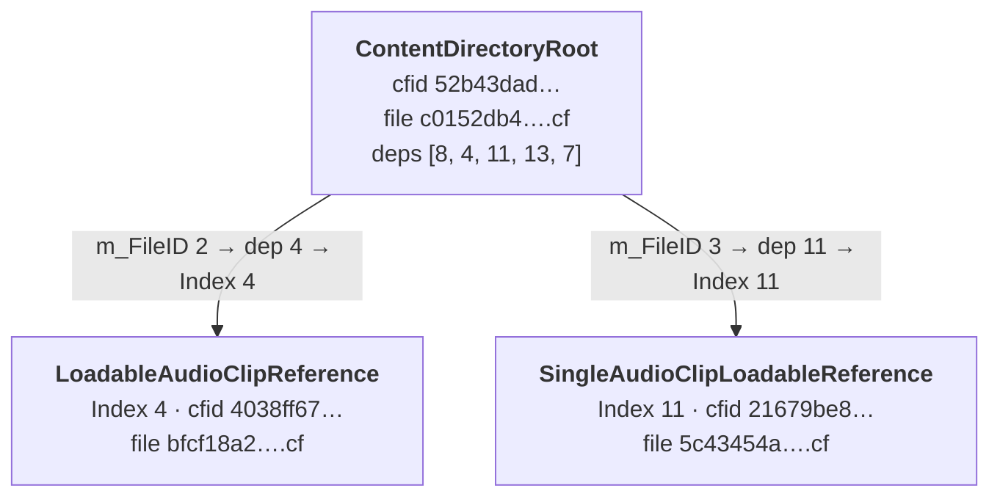

# Content Directory Format

Content directories are a build pipeline introduced in Unity 6.6 for shipping a project's assets as
separate content builds that load alongside a Player build. They are designed as a newer alternative to
[AssetBundles](assetbundle-format.md), with automatic de-duplication of shared content and per-asset
dependency tracking. For the full picture — what
they are, how to build them, and the APIs for loading content — see Unity's Manual topic
[Use content directories to load assets at runtime](https://docs.unity3d.com/6000.6/Documentation/Manual/content-directories.html).

This page focuses on the parts that matter when inspecting a content directory build with
UnityDataTool. It complements the higher-level [Overview of Unity Content](unity-content-format.md),
which introduces SerializedFiles and Unity Archives.

## What a content directory build produces

A content directory build produces the same kinds of data as any other Unity build — SerializedFiles
holding the serialized objects, plus companion `.resS` (texture/mesh) and `.resource` (audio/video)
files — together with a build manifest that records what is needed to load the content at runtime.

The output can be written as loose files or packed into a Unity Archive, so UnityDataTool opens it the
same way it opens Player and AssetBundle content.

An example build, used for testing, can be found in `TestCommon/Data/LeadingEdgeBuilds/ContentDirectory`.

The files use technical, content-hash-based names, rather than the familiar `level0` / `sharedassets`
names of a Player build or the user-specified names of AssetBundles. You do not need to understand the
internal file layout for typical usage — defining what to build, running builds, and loading content
at runtime. This page goes into that detail to help interpret UnityDataTool output in the cases where a
closer look is useful.

> [!IMPORTANT]
> The details of what is *inside* a content directory are subject to change. The stable, supported
> surface is the build and load API and the observable loading behavior. The on-disk data
> representation described here continues to be optimized for size, performance, and incremental-build
> efficiency, so treat the specifics below as informational — do not build tooling that hard-codes
> them.

## Content Files

The SerializedFiles in a content directory are referred to as **Content Files**. They use the same
underlying SerializedFile format as Player builds and AssetBundles — UnityDataTool reads them the same
way — but follow different conventions for naming and for how references between files are recorded.
Content Files were introduced for building subscenes with the Entities package, and content
directories build on the same mechanism.

There is a low-level public API for Content Files
([`Unity.Loading.ContentFile`](https://docs.unity3d.com/ScriptReference/Unity.Loading.ContentFile.html)),
but the content directory loading API encapsulates it and is the recommended way to access content at
runtime.

## File naming

Every build artifact is named by the hash of its own content:

- **Content Files** use the `.cf` extension (for example `c0152db4dd710be51b2decb997325f34.cf`).
- **`.resS`** files hold streamed texture and mesh data.
- **`.resource`** files hold audio and video data.

Because the name is a hash of the content, two artifacts with identical content collapse to the same
file — this is how the pipeline de-duplicates shared content automatically. The `.resS` and
`.resource` data files are granular in the same way as Content Files: a single texture, mesh, or audio
clip per file, each named by its content hash.

A Unity object references data inside a `.resS`/`.resource` file by a content-addressable path of the
form `cah:/<hash>`. This, and the way it differs from AssetBundle and Player builds, is covered in
[References to resource files](#references-to-resource-files) below.

The extensions are informational. The loading system identifies content by its hash (through the
`cah:/` scheme), not by file extension, so the extension is not required to resolve content. Extensions
are present both for loose files and for entries packed inside an archive.

### The build manifest

The build manifest is a JSON file, also named by its content hash (for example
`baff06b928d147276f2245dd3b19216a.json`). It records everything needed to load the content: the list of
Content Files, their dependencies, and the loadable objects and scenes. Its schema is internal and may
change substantially, so this page does not document it. Instead, use
[`ContentLayout.json`](contentlayout.md), which presents the same information (plus source-asset
mapping) in a stable, tool-friendly form.

A small `BuildManifestHash.txt` file records the hash of the manifest, so a tool can find the current
manifest by reading that pointer. When the build is packed into an archive, `BuildManifestHash.txt`
sits outside the archive while the manifest itself is inside it.

### Archives

When the content is packed rather than written loose, it goes into a Unity Archive named
`content0.archive`. The loader will mount additional archives if they are present, provided they follow
sequential names — `content1.archive`, `content2.archive`, and so on — stopping at the first gap.
`BuildPipeline.BuildContentDirectory()` itself only emits the single `content0.archive` containing all
the content. The Addressables package, however, supports splitting the output into multiple archives
based on a maximum-size heuristic. Custom tooling could also perform a loose build and then package the
content into one or more archives as a post-processing "packaging" step, using
[`ContentBuildInterface.ArchiveAndCompress`](https://docs.unity3d.com/ScriptReference/Build.Content.ContentBuildInterface.ArchiveAndCompress.html).

Once all the archives are mounted, references between Content Files, and from Content Files to the
`.resS`/`.resource` data files, resolve through the `cah:/` scheme exactly as they do for loose files.
Archives serve two purposes: reducing the file-system overhead of many loose files in a folder, and
applying compression.

## Build layout granularity

The build layout is highly granular. Typically each source asset becomes its own Content File, and
many files contain just a single Unity object (a Material, Shader, Texture, AudioClip, and so on). A
few grouping rules shape the result:

- **Scenes and Prefabs** store their whole GameObject/Component hierarchy together in a single Content
  File, just as they are represented in the Editor (see [Scenes](#scenes) below).
- **Assets with sub-assets** are split across multiple Content Files. For example an FBX is separated
  so that the component hierarchy and the meshes land in different files.
- **Scripts** are grouped: the `MonoScript` objects for several source scripts can share one Content
  File.
- **Circular direct references are best avoided.** Currently a cycle forces all the affected Unity
  objects to be clustered together into a single Content File, and the build prints a warning. The way
  to break a cycle is to convert one of the references into a `Loadable` (an on-demand reference)
  instead of a direct reference.

Unity's two built-in resource files are handled in different ways:

- **`unity default resources`** is referenced but not included in the build, because those resources
  are always present in the Player that loads the content directory. The manifest carries an entry
  for it flagged as built-in (with no content hash); references to it resolve through the runtime's
  built-in resource mechanism and the `PersistentManager`, rather than through the
  `ContentLoadManager` that manages Content Files.
- **`Resources/unity_builtin_extra`** gets no such special treatment: any referenced objects from it
  (for example the default sprite material and its shader) are included directly in the content
  directory output, in a Content File named by its content hash just like any other file in the
  build. This is because the `unity_builtin_extra` file in a Player is generated per build and
  contains only the project's "Always Included Shaders" — copying the referenced objects into the
  content directory makes it independent of what a particular Player build happens to contain.

## Scenes

Content directory builds can include Unity Scenes. The build parameters only accept ScriptableObject
assets as roots, so a scene enters the build by being referenced through a `LoadableSceneId` field (a
small serializable struct identifying the scene) on an asset reachable from the roots. Every scene
referenced this way is added to the output, along with the assets the scene itself references. At
runtime, such a scene is loaded with `SceneManager.LoadSceneAsync(LoadableSceneId)` once the content
directory is registered.

Each scene produces exactly one Content File, containing only the scene's own GameObject/Component
hierarchy and scene settings objects. The assets the scene references (textures, materials, and so
on) are not packed with it — they land in their own Content Files following the normal
[granularity rules](#build-layout-granularity), and the scene's file reaches them through the
manifest dependency list. This differs from Player builds, where each scene comes with companion
`sharedassets` files holding its assets. Scene Content Files also differ in their object IDs: the
scene's objects get small sequential IDs (1, 2, 3, ...), rather than the 64-bit hash-based IDs used
in other Content Files.

In `ContentLayout.json` (schema details on the [ContentLayout.json](contentlayout.md) page), the
top-level `LoadableSceneIds` array lists each scene with its source path and the Content File that
holds it. From the reference build in `TestCommon/Data/LeadingEdgeBuilds`, which includes two small
scenes:

```json
"LoadableSceneIds": [
  { "GUID": "590cfeb4e0ff90f4e92f9e1262bcfe6f", "Path": "Assets/Scenes/Scene2.unity", "SerializedFile": 6 },
  { "GUID": "162c015549f8733449ac70ae78ad3aa5", "Path": "Assets/Scenes/Scene1.unity", "SerializedFile": 2 }
]
```

The scene's own `SerializedFiles` entry names the scene as its single source asset, and its symbolic
`ID` is derived from the scene's GUID:

```json
{
  "Index": 2,
  "ID": "162c015549f8733449ac70ae78ad3aa5.cfid",
  "SourceAssets": [ "Assets/Scenes/Scene1.unity" ],
  "SerializedFileDependencies": [ 0, 1, 9 ],
  "ContentHash": "c271b85494f5e4cc35c4ec4a776324af"
}
```

So this scene lives in `c271b85494f5e4cc35c4ec4a776324af.cf`, and depends on three other files: the
built-in `unity default resources` entry, the Content File built from `Resources/unity_builtin_extra`
(the default sprite material), and the file holding the Sprite it shows.

A `LoadableSceneId` reference is an on-demand reference, like a `Loadable`: loading the referencing
file does not load the scene. The file holding the reference records the scene by path in its
`LoadableSceneDependencies`, not in `SerializedFileDependencies`, and nothing appears in its
external-reference table — the serialized `LoadableSceneId` field itself only holds the scene's
GUID. The reference build's `SceneList` asset, a ScriptableObject with a dictionary of
`LoadableSceneId` values, shows this:

```json
{
  "Index": 7,
  "ID": "70a210050f71a924aa83be7146547111.cfid",
  "SourceAssets": [ "Assets/ScriptableObjects/SceneList.asset" ],
  "SerializedFileDependencies": [ 8 ],
  "LoadableSceneDependencies": [ "Assets/Scenes/Scene2.unity", "Assets/Scenes/Scene1.unity" ],
  "ContentHash": "8ad4924ac5e264fde63d8e95a0dab8ab"
}
```

## Build history

Every Player and content directory build in Unity 6.6 and later records a **build history** — a set
of files, in a per-build directory, that describe how the build ran and what it produced. By default
these live under `Library/BuildHistory`. The build history is separate from the shipped content and
is not distributed with your application. For the full picture, see the Manual topic
[Analyze builds](https://docs.unity3d.com/6000.6/Documentation/Manual/build-analyze-builds.html).

Most of the files in a build history directory (the Trace Event Profile, `BuildLog.jsonl`,
`ScriptsOnlyCache.yaml`, `ContentSizeSummary.txt`, `BuildReportSummary.json`, and others) are outside
the scope of UnityDataTool and are documented in the Manual's
[Build history file reference](https://docs.unity3d.com/6000.6/Documentation/Manual/build-history-file-reference.html).
Two files in the build history are directly relevant here:

* **[`ContentLayout.json`](contentlayout.md)** — maps the built content back to the source assets in
  the project and describes the dependencies between the produced files. It is the key file for
  understanding a content directory build. [`analyze`](command-analyze.md) imports it into queryable
  database tables and uses it to resolve the references between Content Files (see
  [ContentLayout in the Analyze Database](contentlayout-database.md)).
* **The BuildReport file** — the build report for the build, in the same SerializedFile format that
  UnityDataTool reads for Player and AssetBundle builds. In the build history it is named after the
  build session GUID (rather than the fixed `LastBuild.buildreport` name), so reports from multiple
  builds can sit side by side and be analyzed together. See [BuildReport Support](buildreport.md).

## References between Content Files

References between Content Files work differently from AssetBundles or Player builds, so they are worth
a closer look. In a content directory the reference information is stored **externally to the Content
File**, in the manifest, rather than in the file's own external-reference table. The manifest data is
reproduced in [`ContentLayout.json`](contentlayout.md), which is what the examples below use.

Consider `ContentDirectoryRoot.asset`, which directly references several ScriptableObjects. Its entry
in `ContentLayout.json` names the source asset, the file's own content hash, and — crucially — an
ordered list of the files it depends on:

```json
{
  "Index": 5,
  "ID": "52b43dad178849b42ac753005736e7bb.cfid",
  "SourceAssets": [ "Assets/ScriptableObjects/ContentDirectoryRoot.asset" ],
  "SerializedFileDependencies": [ 8, 4, 11, 13, 7 ],
  "ContentHash": "c0152db4dd710be51b2decb997325f34"
}
```

The `ContentHash` tells us this asset lives in `c0152db4dd710be51b2decb997325f34.cf`. Dumping that file
shows the object's references and the file's external-reference table:

```
UnityDataTool dump --stdout c0152db4dd710be51b2decb997325f34.cf
```
```
External References
path(1): "a2a42d71dddef12e8889849faf59bdd7.cfid" GUID: 00000000000000000000000000000000 Type: 0
path(2): "4038ff673d390134d924b57fcbed0432.cfid" GUID: 00000000000000000000000000000000 Type: 0
path(3): "21679be819d6e9146a63bb02a7e51f2f.cfid" GUID: 00000000000000000000000000000000 Type: 0
path(4): "78532141fd7679a458405eb16bdb75fd.cfid" GUID: 00000000000000000000000000000000 Type: 0
path(5): "70a210050f71a924aa83be7146547111.cfid" GUID: 00000000000000000000000000000000 Type: 0

ID: -775554941117088049 (ClassID: 114) MonoBehaviour
  ...
      data[1] (SerializedKeyValue`2)
        key (string) SingleAudioClipLoadableReference
        value (PPtr<$ScriptableObject>)
          m_FileID (int) 3
          m_PathID (SInt64) -2313013086301746513
```

The external table lists symbolic names ending in `.cfid`, **not** the content-hash filenames.
These `.cfid` strings are placeholders and never exist as files on disk. This is intentional: if the
referencing file embedded the target's content hash, then a single property change could cascade — the
change would alter the target's hash, which would alter every file that referenced it, and so on up
through the build. A key goal of the content directory design is to reduce the amount of content
"churn" when doing updates, so references between Content Files now use an extra level of abstraction.

Because of that, the content of the external table is effectively ignored by the loading system for
Content File references. What counts is the ordered dependency list in the manifest. The
`"SerializedFileDependencies": [8, 4, 11, 13, 7]` array corresponds, in exact size and order, to the
five entries of the external table.

So resolving the reference to `SingleAudioClipLoadableReference` above:

1. The `PPtr` has `m_FileID` 3. A non-zero `m_FileID` is a 1-based index into the external table (0
   would mean "this same file").
2. Index 3 maps to the 3rd entry of `SerializedFileDependencies`, which is `11`.
3. `ContentLayout.json` entry with `"Index": 11` is `SingleAudioClipLoadableReference.asset`, whose
   `ContentHash` is `5c43454a3823f172a2a326410a36ba6b`.
4. The referenced file is therefore `5c43454a3823f172a2a326410a36ba6b.cf`.

A partial mapping for this file, showing how `m_FileID` values in the external table resolve through
the dependency list `[8, 4, 11, 13, 7]` to a content-hash filename:



> [!NOTE]
> The external table's GUID column is all zeros for Content File references (as above). It is used only
> for built-in resource references, which resolve through the runtime's built-in resource mechanism
> instead of the manifest dependency list. The GUIDs in the external table are also used for binary
> SerializedFiles in the Editor (for example in AssetDatabase artifacts).

## References to resource files

The bulk of a texture, mesh, audio clip, or video clip is not stored in the Content File itself but in a
companion data file: a `.resS` file for texture and mesh data, a `.resource` file for audio and video.
A Unity object points at its data with a content-addressable path of the form `cah:/<hash>` (a single
slash; `cah` stands for "content-addressable hash"). Unlike the `.cfid` placeholders used for
[references between Content Files](#references-between-content-files), the `<hash>` here is the real
content hash of the data file, so it resolves directly to `<hash>.resS` or `<hash>.resource` with no
manifest lookup.

The reference build in `TestCommon/Data/LeadingEdgeBuilds/ContentDirectory` deliberately includes both
audio clips and a texture, so it exercises both kinds of data file. Dumping the Content File built from
`Assets/Audio/a.mp3` shows the AudioClip pointing at its `.resource` file, and dumping the one holding
`Assets/Textures/GreenStatic.png`'s texture data shows the Texture2D pointing at its `.resS` file:

```
ID: -6933612096100796476 (ClassID: 83) AudioClip
  m_Name (string) a
  ...
  m_Resource (StreamedResource)
    m_Source (string) cah:/4226b5c16a50dab6eff0f08dd1253d4b
    m_Offset (FileSize) 0
    m_Size (UInt64) 47424
```
```
ID: 1183010003894172340 (ClassID: 28) Texture2D
  m_Name (string) GreenStatic
  m_StreamData (StreamingInfo)
    offset (UInt64) 0
    path (string) cah:/f0a44ad4a4babd121543fd44032928e7
```

So the AudioClip's data lives in `4226b5c16a50dab6eff0f08dd1253d4b.resource` and the texture's in
`f0a44ad4a4babd121543fd44032928e7.resS`.

### One resource per file, deduplicated across the build

Each `.resS` and `.resource` file holds a **single** distinct texture, mesh, audio clip, or video clip.
Because the file is named by its content hash, if several objects reference identical binary data — even
across separate source assets — they all point at the same `cah:/<hash>`, and the build stores that data
only once. Deduplication of shared resource data is therefore automatic, the same way it is for Content
Files.

This is the opposite of how AssetBundle and Player builds lay out resource data. There, all the `.resS`
data needed by a given SerializedFile is concatenated into one companion file belonging to that
SerializedFile (likewise for `.resource`), an object points into it by byte offset and size, and there is
no sharing between SerializedFiles — the same texture used by two bundles is written into each. Content
directories flip this to fine-grained, content-addressed, per-resource files that are shared across the
whole build.

### How the relationship is recorded

The link from a Content File to the resource files it uses is recorded in the `BinaryArtifacts` section
of [`ContentLayout.json`](contentlayout.md), not inside the Content File. Every artifact — each Content
File, each resource file, and the manifest — is an entry with a `Category` and a `Size`, and a Content
File's `ArtifactReferences` point at the resource artifacts it needs. Continuing the `a.mp3` example, its
`contentfile` artifact references the `audio` artifact whose content hash is the `cah:/` target seen
above:

```json
{ "Index": 11, "ContentHash": "730d2d641a53eeb1e633f2ff60d730e9", "Category": "contentfile", "Size": 1288, "ArtifactReferences": [12] },
{ "Index": 12, "ContentHash": "4226b5c16a50dab6eff0f08dd1253d4b", "Category": "audio", "Size": 47424 }
```

When [`analyze`](command-analyze.md) imports the layout it preserves this: the artifacts land in
`content_layout_binary_artifacts` (keyed by `artifact_index`, with `category` and `size`) and the
content-file → resource-file edges in `content_layout_artifact_references`. Resource files never appear
in the core `objects`/`serialized_files` tables, so `content_layout_binary_artifacts` is where their
sizes are recorded. The `content_layout_resource_files_view` walks that edge for you; joined with the
source-asset table it shows which resource file each asset was built into:

```sql
SELECT sa.asset_path, rfv.data_filename, rfv.category, rfv.size
FROM content_layout_resource_files_view rfv
JOIN content_layout_source_assets sa ON sa.serialized_file_index = rfv.file_index
ORDER BY rfv.category, rfv.size;
```
```
asset_path                       data_filename                              category  size
-------------------------------  -----------------------------------------  --------  ------
Assets/Audio/6.mp3               68c9d0b12420e1951eec7790bd0754fe.resource  audio     30688
Assets/Audio/a.mp3               4226b5c16a50dab6eff0f08dd1253d4b.resource  audio     47424
Assets/Textures/GreenStatic.png  f0a44ad4a4babd121543fd44032928e7.resS      texture   215970
Resources/unity_builtin_extra    ea7c9fa2d58ef71544726747da8ade6d.resS      texture   524280
```

The fourth row is the default sprite texture pulled in from `Resources/unity_builtin_extra` (see the
[granularity rules](#build-layout-granularity)). See [ContentLayout in the Analyze
Database](contentlayout-database.md) for the full set of `content_layout` tables and views.

## Inspecting content directory output with UnityDataTool

The `dump` and `serialized-file` commands can be used to inspect serialized files in a content directory.
If the content is distributed inside archive files (e.g. `content0.archive`) then the `archive` command
can be used to view or extract the content.

When you run [`analyze`](command-analyze.md) on a content directory build, analyze the **build output
folder and its matching build history folder together**, in a single `analyze` call, by passing both
paths:

```bash
UnityDataTool analyze /path/to/ContentDirectory /path/to/Library/BuildHistory/<build-directory>
```

Analyzing the build output alone records the objects, but not where they came from — and because the
references between Content Files live in the manifest rather than in the files themselves (see
[References between Content Files](#references-between-content-files) above), those references end up
in the `dangling_refs` table and analyze prints a warning. Including the build history folder fixes
both: the `ContentLayout.json` it contains provides the source-asset mapping (imported as the
`content_layout` tables, see [ContentLayout in the Analyze Database](contentlayout-database.md)) and
the dependency information that analyze uses to resolve the references between Content Files.

Analyze verifies that the `ContentLayout.json` matches the build through the build's
`BuildManifestHash.txt`, so a stale layout from a different build is rejected rather than producing
misleading results. See the [`analyze` command](command-analyze.md#contentdirectory-builds) page for
the exact input combinations.

Note: Passing in the entire build report folder in the build history means that the .buildreport file
will also be analyzed.  That brings in statistics about the build (how long it took etc).  For
content directory builds there is no PackedAssets data, but other build_report_* tables will be populated.
Call `analyze` with the path of the correct ContentLayout.json file, instead of the entire build report folder, if you do not need this extra data.

## Related documentation

| Topic | Description |
|-------|-------------|
| [Use content directories to load assets at runtime](https://docs.unity3d.com/6000.6/Documentation/Manual/content-directories.html) | Unity Manual: what content directories are, and the APIs to build and load them. |
| [Analyze builds](https://docs.unity3d.com/6000.6/Documentation/Manual/build-analyze-builds.html) | Unity Manual: the build history and the build report. |
| [ContentLayout.json](contentlayout.md) | The build layout file that maps content directory output back to source assets. |
| [ContentLayout in the Analyze Database](contentlayout-database.md) | How `analyze` imports `ContentLayout.json` into queryable database tables. |
| [BuildReport Support](buildreport.md) | Analyzing Unity build report files with UnityDataTool. |
| [Overview of Unity Content](unity-content-format.md) | SerializedFiles, Unity Archives, and TypeTrees. |
| [AssetBundle Format](assetbundle-format.md) | The earlier system that content directories are a newer alternative to. |
