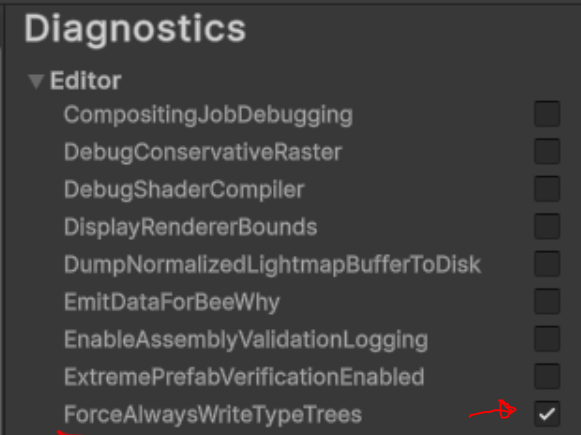

# Player Build Format

This topic digs into the content produced by a Unity Player build, with a focus on the parts that
are useful when inspecting that content with UnityDataTool. It complements the higher-level
[Overview of Unity Content](unity-content-format.md), which introduces SerializedFiles and Unity
Archives.

For Unity's official reference on the output files, see
[Content output of a build](https://docs.unity3d.com/Manual/build-content-output.html). This page
builds on that information with extended detail and practical tips for viewing Player data with
UnityDataTool.

## What UnityDataTool sees

A Player build produces content, compiled code (assemblies, executables), and various configuration
files. UnityDataTool only concerns itself with the **content** portion of that output — the
SerializedFiles (and their companion binary files) that make up the scenes, assets, and settings of
your application. It does not interpret the assemblies, executables, or the small JSON/config files
that accompany the content (see [Files UnityDataTool does not parse](#files-unitydatatool-does-not-parse)).

The content comprises:

- the scenes in the **Scene List**,
- the contents of any `Resources` folders,
- the global project settings (the "Global Game Managers"), and
- every asset referenced from those root inputs.

Because the same SerializedFile and Unity Archive formats are used for both Player builds and
AssetBundles, UnityDataTool can open Player content directly. The one important caveat is TypeTrees,
covered in [TypeTrees in the Player](#typetrees-in-the-player).

## File naming and layout

The SerializedFiles in a Player build are named by a stable convention. You do not create these
files directly, but they show up throughout UnityDataTool output:

| File | Contents |
| --- | --- |
| `level0`, `level1`, … | One file per scene in the **Scene List**, in list order. Holds that scene's GameObject/Component hierarchy. |
| `sharedassets0.assets`, `sharedassets1.assets`, … | Assets referenced from scenes. The number matches the scene that first references the asset. |
| `resources.assets` | Everything found in `Resources` folders, whether or not a scene references it. Loadable at runtime with `Resources.Load`. |
| `globalgamemanagers` | Core engine data and global project settings (Quality, Graphics, Physics, Tags, Layers, and so on). |
| `globalgamemanagers.assets` | Assets referenced from `globalgamemanagers` (for example a render-pipeline settings ScriptableObject). |
| `Resources/unity_builtin_extra` | Built-in shaders and resources, when referenced by the build. |
| `Resources/unity default resources` | Built-in assets (default materials, fonts, meshes) shipped with the Editor. |

Each SerializedFile can be accompanied by binary companion files:

- `.resS` — texture and mesh data, stored so it can be streamed efficiently to the GPU (for example
  `sharedassets0.assets.resS`).
- `.resource` — audio and video data (for example `sharedassets1.resource`; note the `.assets`
  portion of the name is dropped).

Unity keeps this binary data in separate files to reduce memory use at load time.

> [!IMPORTANT]
> Treat the layout and naming above as informational only. Unity may change the exact file
> layout and naming between versions, so don't build tooling that hard-codes it. UnityDataTool
> discovers files rather than assuming specific names.

### Shared-asset grouping

Scenes are processed in Scene List order, and each asset is written into the `sharedassets` file for
the scene that references it **first**. As a result, a scene file only ever references
`sharedassets` files at its own number or lower — `level2` can reference `sharedassets2`,
`sharedassets1`, and `sharedassets0`, but never `sharedassets3`. This "stack-based" ordering ensures
each object is built once instead of being duplicated across scenes, and it deliberately favours the
first scenes in the list (which load first) at the expense of later ones. The
[Content output of a build](https://docs.unity3d.com/Manual/build-content-output.html#shared-asset-grouping)
manual page describes the grouping algorithm in more detail.

To avoid duplication, assets are shared across all the roots: content already written to
`resources.assets` or `globalgamemanagers.assets` is reused rather than copied into a `sharedassets`
file, and vice versa.

The **first scene gets special priority**. Because `level0` is loaded immediately when the player
starts, the layout algorithm tries to keep its dependencies as small as possible. To that end, the
processing order is: gather the Global Game Manager dependencies, build scene 0, then build the
`Resources` content, and only then build the remaining scenes. Placing `resources.assets` *after*
scene 0 but *before* the other scenes puts it higher in the stack than those later scenes: it can
reference objects already assigned to `sharedassets0` (and `globalgamemanagers.assets`), but never
objects in `sharedassets1` or later. The remaining scenes, in turn, can reference `resources.assets`.

## Global Game Managers

`globalgamemanagers` holds the engine's global settings singletons — Player Settings, Quality
Settings, Graphics Settings, Physics, the Tag and Layer definitions, and so on. Assets that those
managers reference are written into `globalgamemanagers.assets`.

One of the managers is the **ResourceManager**, which tracks the contents of the `Resources` folders.
It is serialized inside `globalgamemanagers`, so there is no standalone "resources index" file — but
the assets it points at live in `resources.assets`, not `globalgamemanagers.assets`.

Only the managers relevant to the build are included. Editor-only managers are excluded, and a
manager may be dropped if its feature is not enabled in the project.

## PreloadData

Every `sharedassets` file — and `globalgamemanagers.assets` — contains a **PreloadData** object
(ClassID 150) at local file id 1. Its `m_Assets` vector lists the objects that must be loaded when
that file's content is loaded, including objects that live in *other* files. At runtime Unity walks
this list to pull in the whole dependency set up front, instead of discovering dependencies one
reference at a time.

`resources.assets` is the exception — it does not carry a PreloadData object, because its contents
are loaded individually on demand through the Resources API rather than as a preloaded set. The
`level` and `globalgamemanagers` files also have none.

Dumping the PreloadData from a shared-assets file shows the list of `PPtr`s:

```
UnityDataTool dump --stdout sharedassets0.assets --type PreloadData
```
```
ID: 1 (ClassID: 150) PreloadData
  m_Name (string)
  m_Assets (vector)
    Array<PPtr<Object>>[3]
      data[0] (PPtr<Object>)
        m_FileID (int) 2
        m_PathID (SInt64) 10001
      data[1] (PPtr<Object>)
        m_FileID (int) 1
        m_PathID (SInt64) 27
      data[2] (PPtr<Object>)
        m_FileID (int) 1
        m_PathID (SInt64) 50
  m_Dependencies (vector)
    Array<string>[0]
```

Each entry's `m_FileID` says which file the object lives in, resolved through the file's external
reference table: `0` is this file itself, and higher numbers are entries in that table. Listing the
references for the same file explains the ids above:

```
UnityDataTool sf externalrefs sharedassets0.assets
```
```
Index: 1, Path: globalgamemanagers.assets
Index: 2, Path: Library/unity default resources
```

So `data[0]` (`m_FileID 2`) points at a built-in object in `unity default resources`, while
`data[1]` and `data[2]` (`m_FileID 1`) point into `globalgamemanagers.assets`.

Because PreloadData enumerates the full dependency graph reachable from a file, its size grows with
the number of dependencies. Projects with very large hard-reference graphs (for example a scene
object that directly references thousands of assets, or a scene that references large prefabs from MonoBehaviours) 
can end up with huge PreloadData tables that add
real metadata overhead to the build. The usual remedy is to load some of that content on demand
(via Addressables, AssetBundles, or `Resources.Load`) instead of through direct references.

> [!NOTE]
> The same PreloadData object and loading mechanism are used when scenes are built into
> AssetBundles — Player builds and `BuildPipeline.BuildAssetBundles` share the scene-processing code
> path. The [AssetBundle Format](assetbundle-format.md#preloaddata) topic covers PreloadData from the
> scene-bundle angle.

## Compression: `data.unity3d`

By default a Player build writes the SerializedFiles as loose files in the `Data` folder. If you
enable [`BuildOptions.CompressWithLz4`](https://docs.unity3d.com/ScriptReference/BuildOptions.CompressWithLz4.html)
or [`CompressWithLz4HC`](https://docs.unity3d.com/ScriptReference/BuildOptions.CompressWithLz4HC.html),
Unity instead packs the content into a single Unity Archive called `data.unity3d` — the same archive
format used for AssetBundles. (`Lz4HC` compresses more aggressively than `Lz4` but takes longer to
build; both decompress at the same speed.)

`data.unity3d` contains `globalgamemanagers`, the `level`/`sharedassets` files, `resources.assets`,
and `Resources/unity_builtin_extra`. It does **not** contain `Resources/unity default resources` (the
content build doesn't generate that file) nor the `.resource` audio/video files, which stay outside
the archive.

Whether compression is on by default is platform-specific. Desktop standalone builds are uncompressed
(loose files) unless you opt in, whereas Android and WebGL builds compress the content by default and
so always produce a `data.unity3d`.

Because `data.unity3d` is a Unity Archive, you can open it directly:

```
UnityDataTool archive list Data/data.unity3d
UnityDataTool archive extract Data/data.unity3d -o extracted
```

> [!NOTE]
> The references inside the SerializedFiles are identical whether or not compression is used — a
> reference is always written as, for example, `sharedassets0.assets`, never as a path into
> `data.unity3d`. At runtime the player mounts `data.unity3d` into the `Data` directory via the
> Virtual File System, so those plain names resolve correctly.

## Built-in resource files

Two files come from the Editor installation rather than from your project content, and they behave
differently from the rest of the build output:

- **`Resources/unity default resources`** — default materials, fonts, and meshes that are always
  available. This file is pre-built and shipped with the Editor for each target platform, and simply
  copied into the build. It is **not** rebuilt during your build, so it never has TypeTrees. Expect
  errors when analyzing it, even in a build made with TypeTrees enabled (see
  [TypeTrees in the Player](#typetrees-in-the-player)).
- **`Resources/unity_builtin_extra`** — built-in shaders (for the Built-in Render Pipeline), stored
  in the editor as uncompiled shader source. Only the built-in shaders actually referenced by your content are
  compiled and written into the build output.  The file is small or absent when you use a scriptable
  render pipeline such as URP or HDRP. The project's "Always Included Shaders" list forces specific shaders in even when nothing
  references them directly — useful for shaders you locate at runtime with `Shader.Find()`.

## TypeTrees in the Player

By default, Player builds **do not include TypeTrees**. The expectation for Player data is that you
rebuild all content with each build of the player, so the assemblies and serialized objects always
share matching type definitions and no TypeTree is needed to reconcile them. This keeps the
SerializedFile headers small and makes sure that the fast "streamed" load path is used. 
(See the [TypeTrees](unity-content-format.md#typetrees) section of the
overview for the full explanation.)

UnityDataTool's `analyze` and `dump` commands rely on TypeTrees to interpret object contents, so out
of the box they cannot read Player data. To make Player output usable with those commands, enable
the **ForceAlwaysWriteTypeTrees** Diagnostic Switch (Editor **Preferences → Diagnostics → Editor**)
before building. This is supported starting in Unity 2021.2.



> [!IMPORTANT]
> `ForceAlwaysWriteTypeTrees` is a diagnostic aid, not something to ship. Use it for builds you
> intend to analyze, not for production.

Even with the switch enabled, `Resources/unity default resources` still has no TypeTrees (it is
copied from the Editor, not rebuilt), so analyzing a Player build will report an error for that one
file. This is expected:

```
Error processing file: C:\TestProject\CompressedPlayer\TestProject_Data\Resources\unity default resources
System.ArgumentException: Invalid object id.
```

The [`serialized-file`](command-serialized-file.md) and [`archive`](command-archive.md) commands do
not need TypeTrees, so they work on any Player build.

## Inspecting Player content with UnityDataTool

How you reach the SerializedFiles depends on how the build stored them:

- **Loose files** in the `Data` folder — read them in place.
- **A `data.unity3d` archive** — [`analyze`](command-analyze.md) and [`dump`](command-dump.md) open
  Unity Archives directly, so you can run them on `data.unity3d` without extracting it first.
- **A platform container** (a web `.data` file, an Android `.apk`/`.obb`) — unwrap the outer
  container first (see [Platform details](#platform-details)), then work with the loose files or the
  `data.unity3d` inside.

Once you have the SerializedFiles, [`dump`](command-dump.md) prints the contents of individual
objects, [`serialized-file`](command-serialized-file.md) reports a file's header, object list, and
external references, and [`analyze`](command-analyze.md) builds a queryable SQLite database across the
whole build.

> [!TIP]
> You don't have to complete a full build to inspect the content. After a build, the staged content
> is left in `Library/PlayerDataCache/<Target>/Data` inside your project (Unity keeps it there as a
> cache for the next build). That folder holds the same SerializedFiles that end up in the final
> build's `Data` folder, before any platform-specific packaging, which makes it a convenient place to
> point UnityDataTool — particularly on platforms where the shipped output is wrapped in a container
> file.

### Files UnityDataTool does not parse

The `Data` folder also contains small non-content files that are not SerializedFiles and that
UnityDataTool ignores, including `boot.config` (startup settings), `ScriptingAssemblies.json` (the
list of assemblies), and `RuntimeInitializeOnLoads.json` (methods tagged with
`[RuntimeInitializeOnLoadMethod]`). These are plain config/JSON files; they are mentioned here only
so their presence alongside the content is not surprising.

## StreamingAssets and nested content builds

A Player build can carry additional content-only build output inside its `StreamingAssets` folder,
alongside the main Player content. This is separate content, produced by other build pipelines, that
Unity copies into the build verbatim. Common examples include:

- **AssetBundles**, including the AssetBundles produced by the Addressables package.
- **Content-directory builds.**
- **Entities (DOTS) content** — for example subscene content under `StreamingAssets/ContentArchives`.

Each of these is made up of the same Unity Archives and SerializedFiles as the rest of the build, so
UnityDataTool can open them too.

This matters when you run [`analyze`](command-analyze.md) from the `Data` folder. By default `analyze`
recurses into every subdirectory, discovering archives, SerializedFiles, and other supported files
wherever they are — so it will find the nested content under `StreamingAssets` and analyze it into the
*same* database as the main Player content. That may be what you want (a single database covering
everything shipped), but if you want to analyze only the Player content, pass `--no-recurse` to stop
`analyze` from descending into subdirectories.

## Platform details

The content stage of a Player build is essentially the same on every platform, but the final
packaging differs, so how you reach the SerializedFiles varies.

### Android

On Android the `Data` directory lives inside a container file — an `.apk`, and for larger titles an
`.obb` or Play Asset Delivery asset pack (`.aab` distribution). The content is under
`assets/bin/Data`, and by default it is itself a compressed `data.unity3d` archive, so the
SerializedFiles sit behind two nested container layers.

- You can browse an `.apk` with a standard zip utility (for example 7-Zip; renaming to `.7z` or
  `.zip` can help). Extract the inner `data.unity3d` and then run UnityDataTool on it.
- With the **split binary** option, only the first scene and its dependencies go into the base
  module; later scenes and StreamingAssets content go into separate asset packs installed alongside.

Android output can also depart from the standard layout in ways that affect how you inspect it. The
exact triggers depend on the build configuration (compression, split binary, and related Android
settings), but the two variations worth knowing about are:

- **`resources.assets` written as separate per-asset files.** In some uncompressed configurations
  Android does not combine the `Resources` content into a single `resources.assets`; instead each
  asset is written to its own file named by its GUID. This lets the `.apk`'s zip compression
  decompress individual assets rather than one large combined file. When compression packs everything
  into `data.unity3d` this split does not apply. UnityDataTool can still open each file, but the GUID
  names make it harder to recognise what you are looking at.
- **Large files segmented into `.split` parts.** For **uncompressed** builds, files larger than 1 MB
  are segmented into `...split0`, `...split1`, … parts (for example
  `sharedassets0.assets.resS.split0`), an optimisation for seeking within large files. Unity's file
  system presents these as a single file at runtime, but UnityDataTool and `binary2text` do **not**
  understand the split convention, so this can make uncompressed Android output awkward to analyze
  directly. Compressed Android builds are not split.

### Web (WebGL)

Web builds place the content in a `.data` file (sometimes called a web bundle), which UnityDataTool
opens directly — the [`archive list`](command-archive.md#list) and
[`archive extract`](command-archive.md#extract) commands support it. Inside, you'll find the
compressed `data.unity3d` archive plus the `.resource` audio/video files that are kept outside it.
Once extracted, run any other UnityDataTool command on the output.
