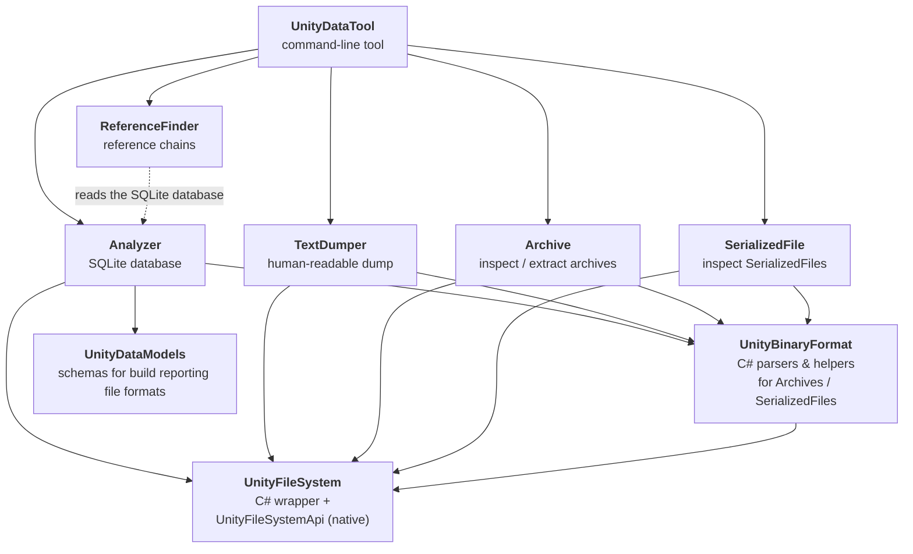

# UnityDataTools

The UnityDataTool is a command line tool and showcase of the UnityFileSystemApi native dynamic library.
The main purpose is for analysis of the content of Unity data files, for example AssetBundles and
Player content.

The [command line tool](./Documentation/unitydatatool.md) runs directly on Unity data files, without requiring the Editor to be running.  It covers most functionality of the Unity tools WebExtract and binary2text, with better performance.  And it adds a lot of additional functionality, for example the ability to create a SQLite database for detailed analysis of build content. See the [Documentation](#documentation) section below for guides to Unity's content formats and to using the tool.

It is designed to scale for large build outputs and has been used to fine-tune big Unity-based games.

The tool also provides comprehensive analysis of **Unity Addressables build reports**, automatically detecting and parsing Addressables JSON build outputs to extract detailed information about bundles, assets, dependencies, file sizes, and build performance metrics. See the [Addressables Build Report Analysis documentation](./Documentation/addressables-build-reports.md) for complete details.

The command line tool uses the UnityFileSystemApi library to access the content of Unity Archives and Serialized files, which are Unity's primary binary formats. This repository also serves as a reference for how this library could be used as part of incorporating functionality into your own tools.

## Documentation

New to Unity's data files or to UnityDataTool? These topics are a good place to start.

**Understanding Unity content**

| Topic | Description |
| --- | --- |
| [Overview of Unity Content](./Documentation/unity-content-format.md) | The core file types (SerializedFiles and Unity Archives), TypeTrees, and how Player and AssetBundle builds are laid out. |
| [AssetBundle Format](./Documentation/assetbundle-format.md) | A hands-on look inside AssetBundles: the AssetBundle object, preload tables, and how scenes are stored. |
| [Player Build Format](./Documentation/playerbuild-format.md) | The Player build layout, compression, built-in resource files, and tips for inspecting Player content (including Android and Web). |
| [ContentLayout.json](./Documentation/contentlayout.md) | The build layout file that maps content-directory build output back to source assets. |

**Using UnityDataTool**

| Topic | Description |
| --- | --- |
| [Command-line tool](./Documentation/unitydatatool.md) | All commands and their options. |
| [Analyzer & database schema](./Documentation/analyzer.md) | The SQLite database that `analyze` produces, including its tables and views. |
| [Example queries](./Documentation/analyze-examples.md) | Worked examples of querying the analyze database. |
| [Comparing builds](./Documentation/comparing-builds.md) | Finding what changed between two builds. |
| [Addressables build reports](./Documentation/addressables-build-reports.md) | Analyzing Addressables JSON build reports. |
| [Build reports](./Documentation/buildreport.md) | Importing a Unity BuildReport to map build output back to source assets. |

## Repository content

The solution is organised in three layers. At the base are the libraries that read Unity's binary
formats. On top of those sit the feature libraries that turn that raw data into something useful
(a database, a text dump, a reference graph). And at the top is the command-line tool that exposes
all of that functionality to users.

**Command-line tool**
* [UnityDataTool](Documentation/unitydatatool.md): the command-line tool. It wires the feature
  libraries together and exposes them as commands (`analyze`, `dump`, `find-refs`, `archive`,
  `serialized-file`, and more), so most users only ever interact with this executable.

**Feature libraries**
* [Analyzer](Documentation/analyzer.md): extracts key information from Unity data files into a SQLite
  database for detailed analysis. It also parses Addressables build reports.
* [TextDumper](Documentation/textdumper.md): dumps SerializedFiles into a human-readable format
  (similar to Unity's binary2text).
* [ReferenceFinder](Documentation/referencefinder.md): finds reference chains from one object to
  another by querying a database produced by the Analyzer (a data dependency rather than a code one).
* [Archive](Documentation/command-archive.md): inspects and extracts the contents of Unity Archives
  (AssetBundles and web platform `.data` files) — the `archive` command.
* [SerializedFile](Documentation/command-serialized-file.md): inspects the header, metadata, object
  list, and external references of a SerializedFile — the `serialized-file` command.

**Base libraries**
* UnityFileSystem: a .NET class library, with source and binaries, that wraps the native
  `UnityFileSystemApi` to mount Unity Archives and read SerializedFiles.
* UnityBinaryFormat: C# parsers and helpers for reading data out of Unity Archives and SerializedFiles.
* UnityDataModels: shared C# models for the reading JSON format files produced by the build (Addressables BuildLayout.json, Content Directory ContentLayout.json).

## Purpose of UnityFileSystemApi

UnityFileSystemApi is compiled from the Unity source code and exposes the core functionality to open and read the Unity Archive and Serialized File formats as a flexible, performant library. It exposes the ability to navigate the TypeTrees inside a SerializedFile so objects can be read generically, without hardcoded type knowledge.

It enables custom tools for binary2text-like output and efficient SQLite database generation.

### Tests and test data

The automated tests are not shown in the diagram above. Each library has its own test project, and the
shared test data doubles as convenient sample content for ad hoc use of the tool.

* TestCommon: a helper library whose `Data/` folder holds small reference files extracted from real
  Unity builds (Player, AssetBundles, content directory etc). These back the automated tests and are also handy for trying out the tool by hand.
* Analyzer.Tests, UnityDataTool.Tests, UnityFileSystem.Tests: the per-library test suites.
* UnityProjects: two Unity projects (`Baseline` and `LeadingEdge`) used to regenerate some of the test
  data as Unity evolves.

## Downloads

Prebuilt Windows and Mac builds are available in the "Actions" tab. Each update to the main branch triggers a new build.

To use:
1. Download and unzip the build for your platform.
2. Run UnityDataTool from the extracted location, or add it to your system PATH.

Refer to the [commit history](https://github.com/Unity-Technologies/UnityDataTools/commits/main/) to see the recent improvements to the tool.

## Getting UnityFileSystemApi

UnityDataTool uses the pre-compiled `UnityFileSystemApi` library to read Unity Archives and SerializedFiles. **Normally you don't need to do anything with this library.** The repository already includes a recent Windows, Mac, and Linux copy in the [`UnityFileSystem/`](https://github.com/Unity-Technologies/UnityDataTools/tree/main/UnityFileSystem) directory, and using that bundled copy is the recommended way to run the tool.

The library is backward compatible but not forward compatible: a given version can read content from the same or older Unity versions, but may be unable to read content produced by a newer Unity Editor than the library itself. The bundled copy is updated periodically as Unity evolves, so in practice it can read content from just about any Unity version.

`UnityFileSystemApi` is also distributed in the `Data/Tools/` folder of the Unity Editor (for all versions since 2022.1.0a14). In the rare case that you need to read content from a Unity version newer than the bundled library, copy the matching file from your Unity Editor installation (`{UnityEditor}/Data/Tools/`) into the `UnityFileSystem/` directory before building:

- Windows: [`UnityFileSystemApi.dll`](https://github.com/Unity-Technologies/UnityDataTools/blob/main/UnityFileSystem/UnityFileSystemApi.dll)
- Mac: [`UnityFileSystemApi.dylib`](https://github.com/Unity-Technologies/UnityDataTools/blob/main/UnityFileSystem/UnityFileSystemApi.dylib)
- Linux: [`UnityFileSystemApi.so`](https://github.com/Unity-Technologies/UnityDataTools/blob/main/UnityFileSystem/UnityFileSystemApi.so)

## How to Build

1. Clone or download this repository.
2. Install the [.NET 9.0 SDK](https://dotnet.microsoft.com/en-us/download/dotnet/9.0).
3. (Optional) Overwrite the checked in version of the UnityFileSystemApi library with one from your Unity Editor installation, as described above.
4. Build using `dotnet build -c Release` or your preferred IDE (tested with Visual Studio and Rider on Windows/Mac).

On Windows, the executable is written to `UnityDataTool\bin\Release\net9.0`. Add this location to your system PATH for convenient access.

See the [command-line tool documentation](./Documentation/unitydatatool.md) for usage instructions.

## Origins

This tool is the evolution of the [AssetBundle Analyzer](https://github.com/faelenor/asset-bundle-analyzer)
written by [Francis Pagé](https://www.github.com/faelenor).

That project was the first to introduce the SQLite database analysis of Unity build output to address
the difficulty of diagnosing build issues through the raw binary2text output, which is large and difficult to navigate.

The AssetBundle Analyzer was quite successful, but it has several issues. It
is extremely slow as it runs WebExtract and binary2text on all the AssetBundles of a project and
has to parse very large text files. It can also easily fail because the syntax used by binary2text
is not standard and can even be impossible to parse in some occasions.

UnityDataTools and UnityFileSystemApi were created to overcome these issues, providing fast, reliable access to Unity data files and enabling advanced analysis.

## Disclaimer

This project is provided on an "as-is" basis and is not officially supported by Unity. It is an experimental tool and example of UnityFileSystemApi usage. Bug reports and pull requests are welcome, but support is not guaranteed.
